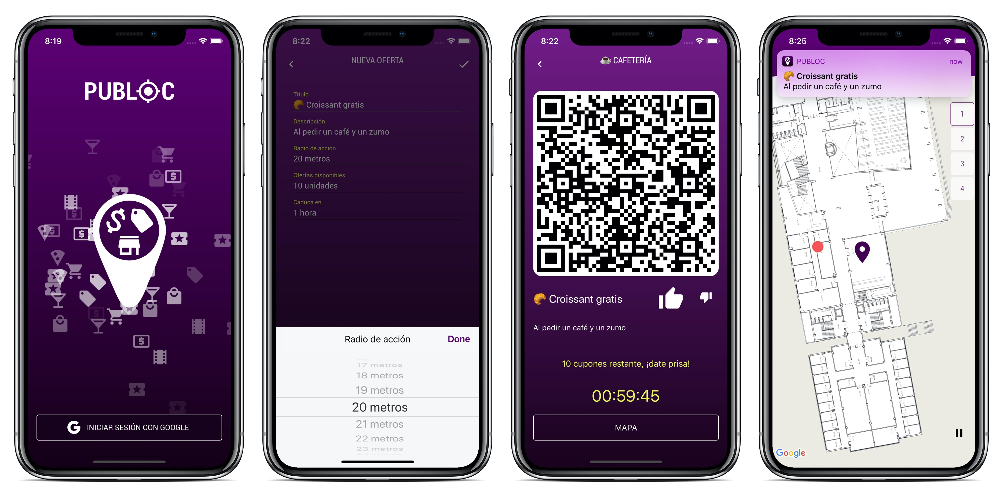
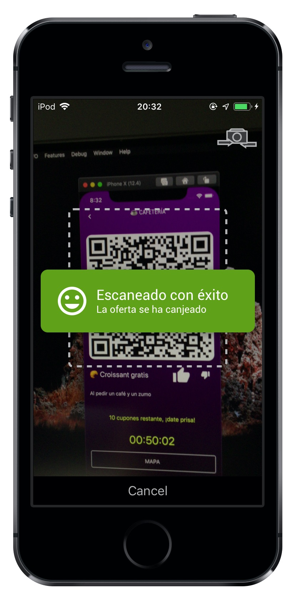

My [Degree Final Project](https://github.com/serg-ios/pub-loc/blob/main/TFG_2018_Rodriguez_Rama_Sergio.pdf) was an iOS app to receive offers and discounts, based on the user's location, in outdoor and indoor areas. Using an indoor positioning system called [Situm](https://situm.com/en/).

## Things learned

🗺 Google Maps SDK

🔑 Google Sign In

🎊 Particle emitters with CAEmitterLayer

🔥 Firebase

  - Real time database, streaming changes with `text/event-stream`
  - REST API to read and write the database
  - Cloud functions
    - Database triggered
    - HTTP triggered

📍 Situm SDK

📷 QR generation and scanning

⏲️ Cron jobs to activate the HTTP triggered cloud functions

🎙️ Siri shortcuts

📨 Testing requests with Postman

🖌️ UI design with Adobe Xd

## How does it work

- Employers
  - Create offers
  - Register employees
- Employees
  - Scan QR codes
- Users
  - Receive offers

	<iframe src="https://www.youtube.com/embed/AGd70H6F-IA?vq=hd1080&mute=1" frameborder="0" allowfullscreen></iframe>

