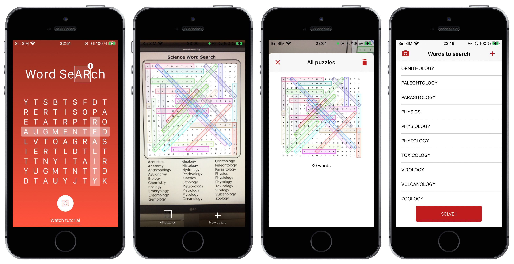

Along with a [colleague](https://www.linkedin.com/in/juansantiagomartin/), we developed a funny app that can find the hidden words of a word search. Once the words are found, the solution is placed over the puzzle with Augmented Reality.

It was available for a year on the App Store and got a few thousand downloads.

## Things learned

🛒 App Store upload process

🤖 SceneKit and ARKit, the solution is placed always over the puzzle, when it changes its position or orientation, the solution changes with it. Multiple solutions can be visible at the same time over their respective word search puzzles

🖍️ UIBezierPaths to mark the solutions

📦 CocoaPods as dependency manager

## Frameworks used

🔎 [FirebaseMLVision](https://firebase.google.com/docs/ml-kit/ios/recognize-text) for text recognition.

✂️ [TOCropViewController](https://github.com/TimOliver/TOCropViewController) to cut the images out.

## How does it works?

A picture is worth a thousand words.

	<iframe src="https://www.youtube.com/embed/LfIDUhi-lrY?vq=hd1080&mute=1" frameborder="0" allowfullscreen></iframe>

