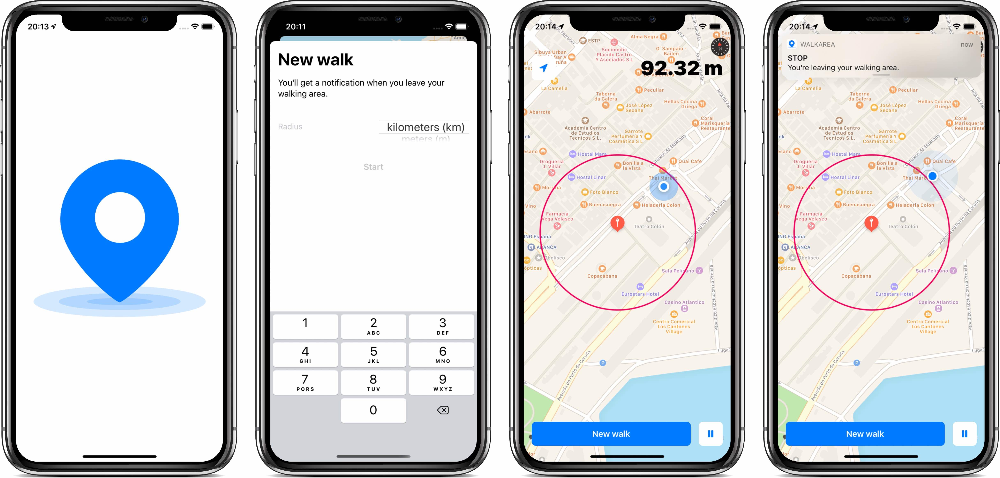
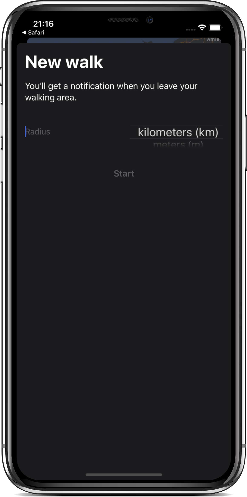
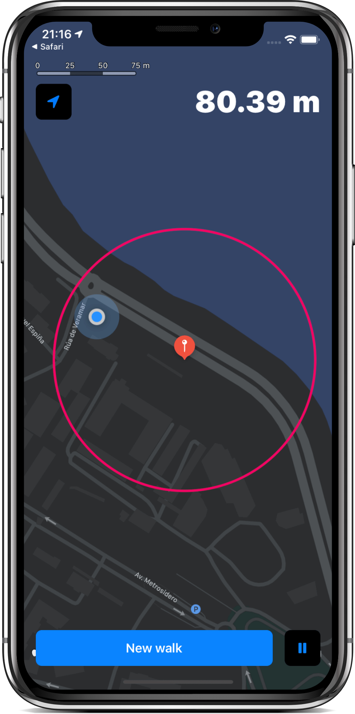
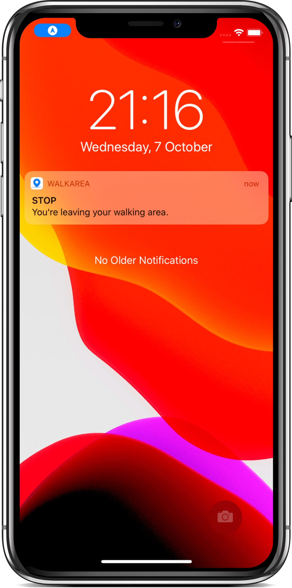

In Spain, confinement measures waned progressively in four steps. In one of these phases, people were not allowed to shift further than a kilometer from their homes.

I built this app, so I could be notified when my walk exceeded the allowed distance.

## Things learned

🗺️ MapKit annotations, overlays, tracking user location in background, distance between points, location simulation with GPX files, and so on.

🌗 Dark / light mode.

👋🏻 Launch screen.

🔔 Notifications with custom sound, managing delivered and pending notifications.

🤓 DispatchGroup.

🌐 App translation.

🧐 Request for user permissions.

## How does it work?

It couldn't be easier :)

### Select the radius of the area

Launch the app when you go out, as close to your home as possible. Your location will be the center of a circular area, whose radius will be the one you indicate.

### Walk

Or move around as you wish.

### Receive notifications

You can leave the app in background while you walk, as soon as you leave your walking area, you will be notified.

