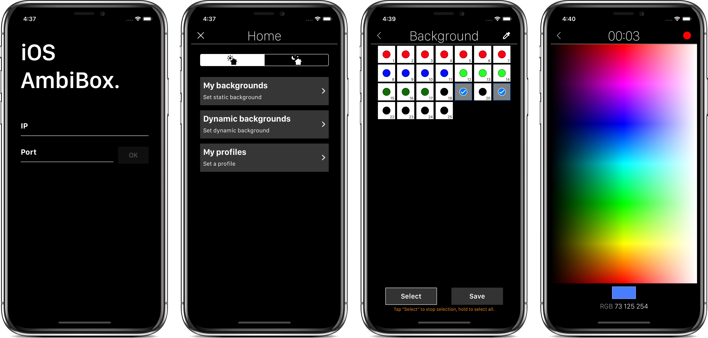

One of my very first own projects, was an app to control my DIY ambilight system. I built it in 2018 and I am very proud of it, although the code needs some improvement.

It was available for a year on the App Store and got a few thousand downloads. Presently, you can [download](https://github.com/serg-ios/ambibox-control) it from my repo.



## Things learned

💾 **Core Data** to store in disk the static and dynamic backgrounds that the user creates.

🌐 **TCP connections** to communicate with the AmbiBox's server API.
```swift
let buffer = UnsafeMutablePointer<UInt8>.allocate(capacity: 4096)

var inputStream: InputStream?
var outputStream: OutputStream?

var lastInputEvent: Stream.Event?
var lastOutputEvent: Stream.Event?
```

➕ Views without storyboard, regular expression management, timers, time triggered notifications, and so on.

## How does it works?

A picture is worth a thousand words.

<div class="video-responsive">
	<iframe src="https://www.youtube.com/embed/5A9H6IOgq54?vq=hd1080&mute=1" frameborder="0" allowfullscreen></iframe>
</div>

---

|----------|--------------------------------|----|
| **0:00** | Connect to the AmbiBox server  | 🔌 |
| **0:05** | Turn on / off                  | 🌗 |
| **0:15** | Static backgrounds             | 🌈 |
| **3:22** | Dynamic backgrounds            | 🎆 |
| **4:58** | Profile selection for movies   | 🎬 |

## What's necessary?

🤖 Arduino with [Adalight](https://learn.adafruit.com/adalight-diy-ambient-tv-lighting/overview) running

🖥️ Computer with [AmbiBox](http://www.ambibox.ru/en/index.php/Download_AmbiBox) installed

👨🏻‍💻 AmbiBox [TCP API](http://www.ambibox.ru/en/index.php/API_server) enabled

📱 iPhone with [AmbiBox control](https://github.com/serg-ios/ambibox-control) installed


{: .box-note}
I also made an Instructables [guide](https://www.instructables.com/AmbiBox-IOS-Remote-Control-App/) to make installation easier.
