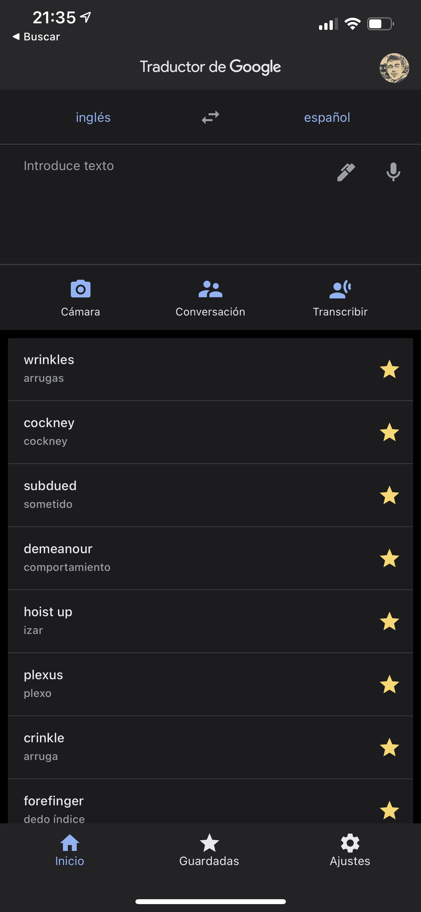
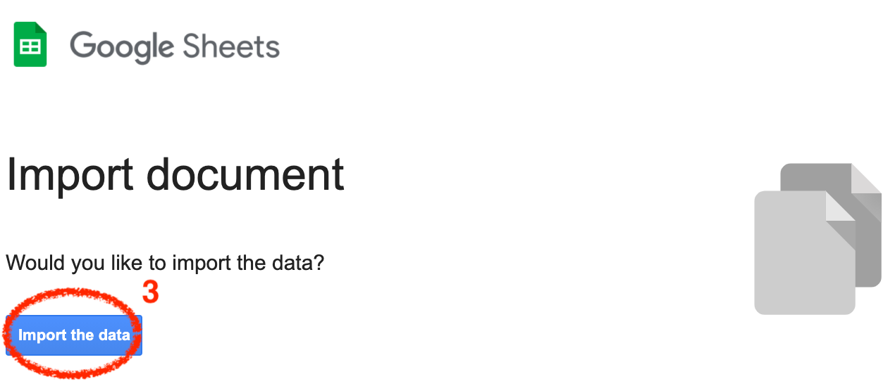

When I am reading a book in a foreign language, I use Google Translate to translate those words that I don't understand.



If I want to save some words, I mark them as favourites, pressing the star button for each word.

This is very useful because if I go to [https://translate.google.es/](https://translate.google.es/), I sign in with the same account and I can export that words into a XLSX file.


When I press this button (3), the file is imported into my Google Drive.

 

### So...

I want to build an app that downloads this file from Google Drive and helps me learn the words with games, Apple Watch complications, widgets, etc.

## Where do I begin?

I created an empty SwiftUI project with UIKit App Delegate life cycle.


Then, I added `GoogleSignIn` and `GoogleAPIClientForREST/Drive` libraries to it, using CocoaPods.

To add CocoaPods to a project, run `pod init` in its main directory. If you don't have `pod` installed in your computer, check [this](https://cocoapods.org/).

```
🙈 ~/Desktop/my-vocabulary/MyVocabulary$pod init
Ignoring ffi-1.12.2 because its extensions are not built. Try: gem pristine ffi --version 1.12.2
Ignoring sassc-2.3.0 because its extensions are not built. Try: gem pristine sassc --version 2.3.0
Ignoring unf_ext-0.0.7.7 because its extensions are not built. Try: gem pristine unf_ext --version 0.0.7.7
[!] Existing Podfile found in directory
```

In my case, `Podfile` already exists, but the first time you run this command, it'll be created.

The deployment target of my app is iOS 14.0, but your `Podfile` must look like mine.
```
platform :ios, '14.0'

target 'MyVocabulary' do
  use_frameworks!
  pod 'GoogleSignIn'
  pod 'GoogleAPIClientForREST/Drive'
end
```

These libraries are necessary because I will need to authenticate myself in order to access my Google Drive files.

Finish and run `pod install`.

```
🙈 ~/Desktop/my-vocabulary/MyVocabulary$pod install
Ignoring ffi-1.12.2 because its extensions are not built. Try: gem pristine ffi --version 1.12.2
Ignoring sassc-2.3.0 because its extensions are not built. Try: gem pristine sassc --version 2.3.0
Ignoring unf_ext-0.0.7.7 because its extensions are not built. Try: gem pristine unf_ext --version 0.0.7.7
Analyzing dependencies
Downloading dependencies
Installing AppAuth (1.4.0)
Installing GTMAppAuth (1.1.0)
Installing GTMSessionFetcher (1.5.0)
Installing GoogleAPIClientForREST (1.5.1)
Installing GoogleSignIn (5.0.2)
Generating Pods project
Integrating client project
Pod installation complete! There are 2 dependencies from the Podfile and 5 total pods installed.
```

Once you've installed CocoaPods, close your project, open Xcode again and select your **workspace**. This is very important, otherwise, your project won't build.


## Google Sign In

The first thing that must be done is authentication with Google credentials in order to access Google Drive.

**To be continued...**
