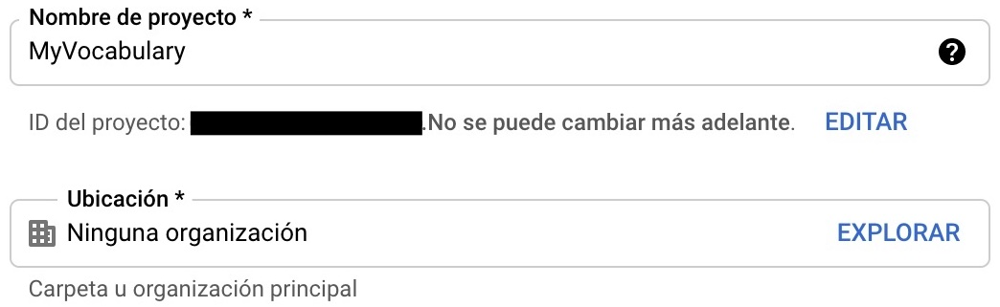
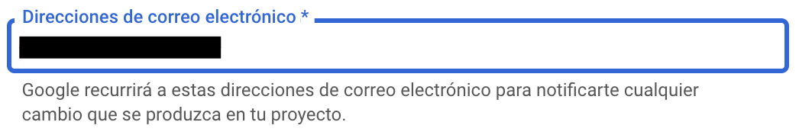

When I am reading a book in a foreign language, I use Google Translate to translate those words that I don't understand...


If I want to save some words, I mark them as favourites, pressing the star button for each word.

This is very useful because if I go to [https://translate.google.es/](https://translate.google.es/), I sign in with the same account and I can export that words into a XLSX file.


When I press this button (3), the file is imported into my Google Drive.

 

### So...

I want to build an app that downloads this file from Google Drive and helps me learn the words with games, Apple Watch complications, widgets, etc.

## Where do I begin?

I created an empty SwiftUI project with UIKit App Delegate life cycle.


Then, I added `GoogleSignIn` and `GoogleAPIClientForREST/Drive` libraries to it, using CocoaPods.

To add CocoaPods to a project, run `pod init` in its main directory. If you don't have `pod` installed in your computer, check [this](https://cocoapods.org/).

```
🙈 ~/Desktop/my-vocabulary/MyVocabulary$pod init
Ignoring ffi-1.12.2 because its extensions are not built. Try: gem pristine ffi --version 1.12.2
Ignoring sassc-2.3.0 because its extensions are not built. Try: gem pristine sassc --version 2.3.0
Ignoring unf_ext-0.0.7.7 because its extensions are not built. Try: gem pristine unf_ext --version 0.0.7.7
[!] Existing Podfile found in directory
```

In my case, `Podfile` already exists, but the first time you run this command, it'll be created.

The deployment target of my app is iOS 14.0, but your `Podfile` must look like mine.
```
platform :ios, '14.0'

target 'MyVocabulary' do
  use_frameworks!
  pod 'GoogleSignIn'
  pod 'GoogleAPIClientForREST/Drive'
end
```

These libraries are necessary because I will need to authenticate myself in order to access my Google Drive files.

Finish and run `pod install`.

```
🙈 ~/Desktop/my-vocabulary/MyVocabulary$pod install
Ignoring ffi-1.12.2 because its extensions are not built. Try: gem pristine ffi --version 1.12.2
Ignoring sassc-2.3.0 because its extensions are not built. Try: gem pristine sassc --version 2.3.0
Ignoring unf_ext-0.0.7.7 because its extensions are not built. Try: gem pristine unf_ext --version 0.0.7.7
Analyzing dependencies
Downloading dependencies
Installing AppAuth (1.4.0)
Installing GTMAppAuth (1.1.0)
Installing GTMSessionFetcher (1.5.0)
Installing GoogleAPIClientForREST (1.5.1)
Installing GoogleSignIn (5.0.2)
Generating Pods project
Integrating client project
Pod installation complete! There are 2 dependencies from the Podfile and 5 total pods installed.
```

Once you've installed CocoaPods, close your project, open Xcode again and select your **workspace**. This is very important, otherwise, your project won't build.


## Google Cloud Platform

The first thing that must be done is authentication with Google credentials in order to access Google Drive.

It's necessary an Google API Key .

1. Visit your Google Cloud Platform [dashboard](https://console.cloud.google.com/projectselector2/home/dashboard) and create a project.

    

2. Give a name to it.

    

3. Go to your APIs.

    

4. Enable Google Drive API.

    

    

    

5. Create credentials.

    

    

6. Configure OAuth screen.

    

    

    

    

7. Add testing emails, here you should add the Google account in which you have your translations. You will not be able to sign in during development with no registered testing emails.

    

8. Finish the configuration of your OAuth client.

    

9. Download the `plist` that contains `CLIENT_ID` and `REVERSED_CLIENT_ID`.

    

## URL Types configuration

Open the **workspace** of your project and go to Target > Info > **Url Types**.

You should add two **Url Types**, one with the value of the `CLIENT_ID` as URL Scheme and the other with the value of the `REVERSED_CLIENT_ID` of the downloaded file.


```xml
<?xml version="1.0" encoding="UTF-8"?>
<!DOCTYPE plist PUBLIC "-//Apple//DTD PLIST 1.0//EN" "http://www.apple.com/DTDs/PropertyList-1.0.dtd">
<plist version="1.0">
<dict>
	<key>CLIENT_ID</key>
	<string>xxxxxxxxxxxxx.apps.googleusercontent.com</string>
	<key>REVERSED_CLIENT_ID</key>
	<string>com.googleusercontent.apps.xxxxxxxxxxxxx</string>
	<key>PLIST_VERSION</key>
	<string>1</string>
	<key>BUNDLE_ID</key>
	<string>com.serg-ios.MyVocabulary</string>
</dict>
</plist>
```

Build the project, everything should work fine 🤞

## Google Sign In, SwiftUI implementation

Google Sign In needs a delegate that will receive all the feedback of the process.

```swift
import GoogleSignIn

class GoogleSignInDelegate: NSObject, GIDSignInDelegate, ObservableObject {
    func sign(_ signIn: GIDSignIn!, didSignInFor user: GIDGoogleUser!, withError error: Error!) {
        guard error == nil else {
            // Handle errors.
            return
        }
        print("Google Sign In - success")
    }
}
```

The singleton that handles the sign in process needs the `clientID` property and its delegate to be setted, this must be done in the `didFinishLaunchingWithOptions` method of out `AppDelegate`.

```swift
@main
class AppDelegate: UIResponder, UIApplicationDelegate {

    let googleSignDelegate = GoogleSignInDelegate()

    func application(_ application: UIApplication, didFinishLaunchingWithOptions launchOptions: [UIApplication.LaunchOptionsKey: Any]?) -> Bool {
        GIDSignIn.sharedInstance().clientID = "xxxxxxxxxxxxx.apps.googleusercontent.com"
        GIDSignIn.sharedInstance().delegate = googleSignDelegate
        return true
    }

    // ...
}
```

Now, the **Google Sign In** button must be implemented. We can create our own custom view but we are going to use the default one provided by Google. Unfortunately, this button is not available in SwiftUI, to use it `UIViewRepresentable` must be implemented.

```swift
import GoogleSignIn
import SwiftUI

struct GoogleSignInButton: UIViewRepresentable {
    func makeUIView(context: Context) -> GIDSignInButton {
        GIDSignInButton()
    }

    func updateUIView(_ uiView: UIViewType, context: Context) {
        // ...
    }
}
```

Using `GIDSignInButton` is **not necessary** to call the `signIn` method manually.

```swift
GIDSignIn.sharedInstance()?.signIn()
```

You're almost ready to go, go to your `ContentView` and replace its default body implementation for this one...

```swift
struct ContentView: View {
    var body: some View {
        GoogleSignInButton()
    }
}
```

Now run the project, press the button that appears in the top of the screen and you'll see an error.

```
Terminating app due to uncaught exception 'NSInvalidArgumentException', 
reason: 'presentingViewController must be set.'
```

The Google Sign In singleton has a property `presentingViewController` that must refer the view controller that will present the sign in screen. To fix this, some changes must be done in our `SceneDelegate`.

```swift
import UIKit
import SwiftUI
import GoogleSignIn

class SceneDelegate: UIResponder, UIWindowSceneDelegate {

    var window: UIWindow?

    func scene(_ scene: UIScene, willConnectTo session: UISceneSession, options connectionOptions: UIScene.ConnectionOptions) {
        let googleSignDelegate = (UIApplication.shared.delegate as! AppDelegate).googleSignDelegate
        let contentView = ContentView()
        if let windowScene = scene as? UIWindowScene {
            let window = UIWindow(windowScene: windowScene)
            window.rootViewController = UIHostingController(rootView: contentView)
            // Set the window root view controller as the `GIDSignIn` presenting view controller.
            GIDSignIn.sharedInstance().presentingViewController = window.rootViewController
            self.window = window
            window.makeKeyAndVisible()
        }
    }

    // ...
}
```

Run the project and press the button again.


Continue...


Select an account that you included in the list "test emails" during the Google Cloud Platform configuration.


Look for this message in the Xcode logs...

```
Google Sign In - success
```

Hurray!! 🎉 🥳 🎊 

You have implemented the simplest sign in with Google, no handling errors, no keeping session open after closing the app... But this will come later.

**To be continued...**
