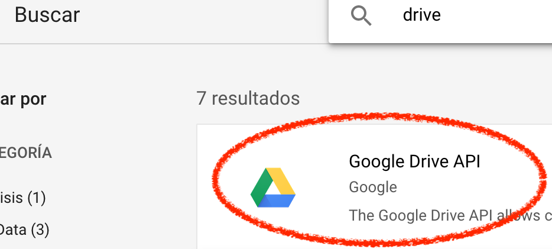
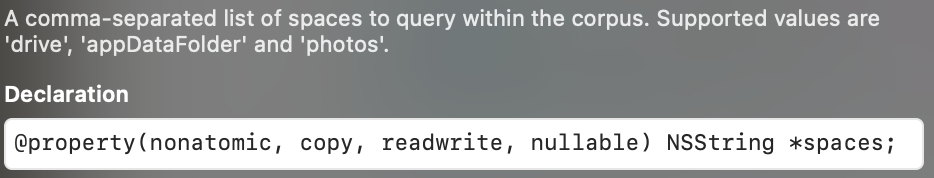

When I am reading a book in a foreign language, I use Google Translate to translate those words that I don't understand...

## Index

1. [Index](#index)
2. [Introduction](#introduction)
3. [First steps](#first-steps)
4. [Google Cloud Platform](#google-cloud-platform)
5. [URL Types configuration](#url-types-configuration)
6. [Google Sign In, SwiftUI implementation](#google-sign-in-swiftui-implementation)
7. [Don't upload API Keys to Git](#dont-upload-api-keys-to-git)
8. [Download spreadsheets from Google Drive](#download-spreadsheets-from-google-drive)
9. [Parse spreadsheet's translations](#parse-spreadsheets-translations)

## Introduction

If I want to save some words, I mark them as favourites, pressing the star button for each word.


This is very useful because if I go to [https://translate.google.es/](https://translate.google.es/), I sign in with the same account and I can export that words into a XLSX file.

 

### So...

I want to build an app that downloads this file from Google Drive and helps me learn the words with games, Apple Watch complications, widgets, etc.

## First steps

I created an empty SwiftUI project with UIKit App Delegate life cycle.


Then, I added `GoogleSignIn` and `GoogleAPIClientForREST/Drive` libraries to it, using CocoaPods.

To add CocoaPods to a project, run `pod init` in its main directory. If you don't have `pod` installed in your computer, check [this](https://cocoapods.org/).

```
🙈 ~/Desktop/my-vocabulary/MyVocabulary$pod init
Ignoring ffi-1.12.2 because its extensions are not built. Try: gem pristine ffi --version 1.12.2
Ignoring sassc-2.3.0 because its extensions are not built. Try: gem pristine sassc --version 2.3.0
Ignoring unf_ext-0.0.7.7 because its extensions are not built. Try: gem pristine unf_ext --version 0.0.7.7
[!] Existing Podfile found in directory
```

In my case, `Podfile` already exists, but the first time you run this command, it'll be created.

The deployment target of my app is iOS 14.0, but your `Podfile` must look like mine.
```
platform :ios, '14.0'

target 'MyVocabulary' do
  use_frameworks!
  pod 'GoogleSignIn'
  pod 'GoogleAPIClientForREST/Drive'
end
```

These libraries are necessary because I will need to authenticate myself in order to access my Google Drive files.

Finish and run `pod install`.

```
🙈 ~/Desktop/my-vocabulary/MyVocabulary$pod install
Ignoring ffi-1.12.2 because its extensions are not built. Try: gem pristine ffi --version 1.12.2
Ignoring sassc-2.3.0 because its extensions are not built. Try: gem pristine sassc --version 2.3.0
Ignoring unf_ext-0.0.7.7 because its extensions are not built. Try: gem pristine unf_ext --version 0.0.7.7
Analyzing dependencies
Downloading dependencies
Installing AppAuth (1.4.0)
Installing GTMAppAuth (1.1.0)
Installing GTMSessionFetcher (1.5.0)
Installing GoogleAPIClientForREST (1.5.1)
Installing GoogleSignIn (5.0.2)
Generating Pods project
Integrating client project
Pod installation complete! There are 2 dependencies from the Podfile and 5 total pods installed.
```

Once you've installed CocoaPods, close your project, open Xcode again and select your **workspace**. This is very important, otherwise, your project won't build.


## Google Cloud Platform

The first thing that must be done is authentication with Google credentials in order to access Google Drive.

It's necessary an Google API Key .

1. Visit your Google Cloud Platform [dashboard](https://console.cloud.google.com/projectselector2/home/dashboard) and create a project.
2. Give a name to it.

    

3. Go to your APIs.

    

4. Enable Google Drive API.

    

5. Create credentials.

    

6. Configure OAuth screen.

    

7. Add testing emails, here you should add the Google account in which you have your translations. You will not be able to sign in during development with no registered testing emails.

    

8. Finish the configuration of your OAuth client.

    

9. In APIs and Services > Credentials, download the `plist` that contains `CLIENT_ID` and `REVERSED_CLIENT_ID`.

    

## URL Types configuration

Open the **workspace** of your project and go to Target > Info > **Url Types**.

You should add two **Url Types**, one with the value of the `CLIENT_ID` as URL Scheme and the other with the value of the `REVERSED_CLIENT_ID` of the downloaded file.


```xml
<?xml version="1.0" encoding="UTF-8"?>
<!DOCTYPE plist PUBLIC "-//Apple//DTD PLIST 1.0//EN" "http://www.apple.com/DTDs/PropertyList-1.0.dtd">
<plist version="1.0">
<dict>
	<key>CLIENT_ID</key>
	<string>xxxxxxxxxxxxx.apps.googleusercontent.com</string>
	<key>REVERSED_CLIENT_ID</key>
	<string>com.googleusercontent.apps.xxxxxxxxxxxxx</string>
	<key>PLIST_VERSION</key>
	<string>1</string>
	<key>BUNDLE_ID</key>
	<string>com.serg-ios.MyVocabulary</string>
</dict>
</plist>
```

Build the project, everything should work fine 🤞

## Google Sign In, SwiftUI implementation

<a name="didsignin">Google Sign In needs a delegate that will receive all the feedback of the process.</a>

```swift
import GoogleSignIn

class GoogleSignInDelegate: NSObject, GIDSignInDelegate, ObservableObject {
    func sign(_ signIn: GIDSignIn!, didSignInFor user: GIDGoogleUser!, withError error: Error!) {
        guard error == nil else {
            // Handle errors.
            return
        }
        print("Google Sign In - success")
    }
}
```

<a name="appdelegate">The singleton that handles the sign in process needs the `clientID` property and its delegate to be setted, this must be done in the `didFinishLaunchingWithOptions` method of out `AppDelegate`.</a>

```swift
@main
class AppDelegate: UIResponder, UIApplicationDelegate {

    let googleSignDelegate = GoogleSignInDelegate()

    func application(_ application: UIApplication, didFinishLaunchingWithOptions launchOptions: [UIApplication.LaunchOptionsKey: Any]?) -> Bool {
        GIDSignIn.sharedInstance().clientID = "xxxxxxxxxxxxx.apps.googleusercontent.com"
        GIDSignIn.sharedInstance().delegate = googleSignDelegate
        return true
    }

    // ...
}
```

Now, the **Google Sign In** button must be implemented. We can create our own custom view but we are going to use the default one provided by Google. Unfortunately, this button is not available in SwiftUI, to use it `UIViewRepresentable` must be implemented.

```swift
import GoogleSignIn
import SwiftUI

struct GoogleSignInButton: UIViewRepresentable {

    @Environment(\.colorScheme) var colorScheme

    private var button: GIDSignInButton = GIDSignInButton()

    func makeUIView(context: Context) -> GIDSignInButton {
        button.colorScheme = self.colorScheme == .dark ? .dark : .light
        return button
    }

    func updateUIView(_ uiView: UIViewType, context: Context) {
        button.colorScheme = self.colorScheme == .dark ? .dark : .light
    }
}
```

Using `GIDSignInButton` is **not necessary** to call the `signIn` method manually.

```swift
GIDSignIn.sharedInstance()?.signIn()
```

You're almost ready to go, go to your `ContentView` and replace its default body implementation for this one...

```swift
struct ContentView: View {
    var body: some View {
        NavigationView {
            VStack {
                Spacer()
                GoogleSignInButton()
                    .frame(alignment: .center)
                    .padding(.horizontal, 50)
                    .navigationTitle("My Vocabulary")
            }
        }
    }
}
```

Now run the project, press the button that appears in the top of the screen and you'll see an error.

```
Terminating app due to uncaught exception 'NSInvalidArgumentException', 
reason: 'presentingViewController must be set.'
```

The Google Sign In singleton has a property `presentingViewController` that must refer the view controller that will present the sign in screen. To fix this, some changes must be done in our `SceneDelegate`.

```swift
import UIKit
import SwiftUI
import GoogleSignIn

class SceneDelegate: UIResponder, UIWindowSceneDelegate {

    var window: UIWindow?

    func scene(_ scene: UIScene, willConnectTo session: UISceneSession, options connectionOptions: UIScene.ConnectionOptions) {
        let googleSignDelegate = (UIApplication.shared.delegate as! AppDelegate).googleSignDelegate
        let contentView = ContentView()
        if let windowScene = scene as? UIWindowScene {
            let window = UIWindow(windowScene: windowScene)
            window.rootViewController = UIHostingController(rootView: contentView)
            // Set the window root view controller as the `GIDSignIn` presenting view controller.
            GIDSignIn.sharedInstance().presentingViewController = window.rootViewController
            self.window = window
            window.makeKeyAndVisible()
        }
    }

    // ...
}
```

Run the project, press the button again and select an account that you included in the list "test emails" during the Google Cloud Platform configuration.

 

Look for this message in the Xcode logs...

```
Google Sign In - success
```

Hurray!! 🎉 🥳 🎊 

You have implemented the simplest sign in with Google, no handling errors, no keeping session open after closing the app... But this will come later.

## Don't upload API Keys to Git

If you have a public repository you might want to hide your Google Sign In Client ID.

Instead of hardcoding API keys into `Info.plist` or `AppDelegate`, they can be hidden in many ways, so they are not available in your repo.

Open the `xcconfig` files of your project.


```
MyVocabulary/Pods/Target\ Support\ Files/Pods-MyVocabulary/Pods-MyVocabulary.release.xcconfig
MyVocabulary/Pods/Target\ Support\ Files/Pods-MyVocabulary/Pods-MyVocabulary.debug.xcconfig
```

Append `REVERSED_CLIENT_ID` and `CLIENT_ID` at the end of both files (the name of the variables can be modified).

```
GOOGLE_SIGN_IN_REVERSED_CLIENT_ID=com.googleusercontent.apps.xxxxxxxxxxxxx
GOOGLE_SIGN_IN_CLIENT_ID=xxxxxxxxxxxxx.apps.googleusercontent.com
```

You don't want to upload this changes to your repo, so before doing `git add` of those files, you must indicate that changes in those files must not be taken into consideration.

```
git update-index --assume-unchanged MyVocabulary/Pods/Target\ Support\ Files/Pods-MyVocabulary/Pods-MyVocabulary.debug.xcconfig
git update-index --assume-unchanged MyVocabulary/Pods/Target\ Support\ Files/Pods-MyVocabulary/Pods-MyVocabulary.release.xcconfig
```

Note: If later you want to make changes into `xcconfig` files and upload them into your repo, remember to revert this.

```
git update-index --no-assume-unchanged <file>
```

Now, the variables can be used in the `Info.plist` doing `$(GOOGLE_SIGN_IN_CLIENT_ID)` and `$(GOOGLE_SIGN_IN_REVERSED_CLIENT_ID)`. Please, when adding the new URLTypes, give them an unique identifier.


We are almost there... Remember that the client ID was needed in the `AppDelegate` to be setted into `GIDSignIn.sharedInstance().clientID`? I made an extension of `Bundle` that obtains URLType's URL Schemes giving its identifier (see previous step).

```swift
extension Bundle {
    static func urlScheme(urlTypeId: String) -> String? {
        (((main.infoDictionary?["CFBundleURLTypes"] as? [[String: Any]])?
            .first(where: { $0["CFBundleURLName"] as? String == urlTypeId}))?["CFBundleURLSchemes"] as? [String])?.first
    }
}
```

Instead of hardcoding the API key in the `AppDelegate`...

```swift
GIDSignIn.sharedInstance().clientID = Bundle.urlScheme(urlTypeId: "GOOGLE_SIGN_IN_CLIENT_ID")
```

## Download spreadsheets from Google Drive

An **scope** must be added to the Google Sign In [configuration](#appdelegate) in the App Delegate's `didFinishLaunchingWithOptions` method, in order to request the user permissions for accessing Google Drive files.

```swift
import GoogleAPIClientForREST
// ...
GIDSignIn.sharedInstance().scopes = [kGTLRAuthScopeDriveReadonly]
```

[Here](https://developers.google.com/drive/api/v3/reference/files/list) is the Google documentation for the Google Drive API requests that are needed.

A reference of the Google Drive service authorizer must be saved, add to the `GoogleSignInDelegate` a reference to the service.
```swift
private let googleDriveService = GTLRDriveService()
```
Then, in the implementation of [`didSignIn`](#didsignin), save the authorizer.
```swift
googleDriveService.authorizer = user.authentication.fetcherAuthorizer()
```

### Fetch all spreadsheets

A `GTLRDrive_FileList` will be downloaded using a Google Drive's REST API query. This can also download files from Google Photos, for instance. In this case, only Drive files are needed, so the `spaces` and `corpora` properties must be setted.
```swift
let query = GTLRDriveQuery_FilesList.query()
query.spaces = "drive"
query.corpora = "user"
```
 



By default, not all the fields of the `GTLRDrive_File` are fetched, indicate which ones must be requested.
```swift
query.fields = "files(id,name,modifiedTime,size)"
```
Also, tell the query to look only for spreadsheets.
```swift
let spreadsheetOnly = "mimeType = 'application/vnd.google-apps.spreadsheet'"
query.q = "\(spreadsheetOnly)"
```
Then, just execute the query and wait for the result, a `GTLRDrive_FileList`.
```swift
googleDriveService.executeQuery(query) { [weak self] _, result, error in
    guard error == nil else { return }
    for file in (result as? GTLRDrive_FileList)?.files ?? [] {
        // ...
    }
}
```
This query will return all the spreadsheets linked with that account, even those that are shared with other users or those that are in the Trash. Filters can be added, for instace, to fetch only files owned by the user and not other user's shared files.
```swift
let ownedByUser = "'\(email)' in owners"
query.q = "\(spreadsheetOnly) and \(ownedByUser)"
```
### Fetch the content of each spreadsheet

The previous query only fetched info about the files, to get the whole file, other request must be made with the Google Drive service fetcher.

The ID of each spreadsheet must be included in the URL, in following example, replace the %@ with it.
```swift
private func spreadsheetUrl(id: String) -> URL? {
    URL(string: String(format: "https://www.googleapis.com/drive/v3/files/%@/export?alt=media&mimeType=application/vnd.openxmlformats-officedocument.spreadsheetml.sheet", id))
}
```
Use the URL to fetch the resource with Google Service.
```swift
googleDriveService.fetcherService.fetcher(with: url).beginFetch { [weak self] data, error in
    guard error == nil, let data = data else { return }
    // Handle the data
}
```

## Parse spreadsheet's translations

This is not as straightforward as fetching the data, to do this, there are libraries like [CoreXLSX](https://github.com/CoreOffice/CoreXLSX).

Adding it to your project is very simple with CocoaPods.
```
platform :ios, '14.0'

target 'MyVocabulary' do
  use_frameworks!
  # ...
  pod 'CoreXLSX'
end
```

### ♦️ Important

Before doing `pod install`,mark the `xcconfig` files as **no-assume-unchanged**.
```
git update-index --no-assume-unchanged MyVocabulary/Pods/Target\ Support\ Files/Pods-MyVocabulary/Pods-MyVocabulary.release.xcconfig
git update-index --no-assume-unchanged MyVocabulary/Pods/Target\ Support\ Files/Pods-MyVocabulary/Pods-MyVocabulary.debug.xcconfig
```

Then, install the new pod and you'll see that there are changes in that 2 files, check the files before uploading the changes (if you don't want to upload your API keys) and then upload them.

Now, the keys can be added again to the `xcconfig` files and the files must be marked again as **assume-unchanged**.
```
git update-index --assume-unchanged MyVocabulary/Pods/Target\ Support\ Files/Pods-MyVocabulary/Pods-MyVocabulary.debug.xcconfig
git update-index --assume-unchanged MyVocabulary/Pods/Target\ Support\ Files/Pods-MyVocabulary/Pods-MyVocabulary.release.xcconfig
```

To avoid uploading API Keys to your repo, do this every time you want to add a new library via CocoaPods.

### ♦️

Once installed the framework, here is how the rows of the spreadsheet can be accessed. Each row is an array of cells, this operation can throw several kind of errors that can be handled.
```swift
import CoreXLSX
// ...
do {
    let file = try XLSXFile(data: data)
    guard let sharedStrings = try file.parseSharedStrings() else { return }
    let workbooks = try file.parseWorkbooks()
    for workbook in workbooks {
        let pathsAndNames = try file.parseWorksheetPathsAndNames(workbook: workbook)
        for (_, path) in pathsAndNames {
            let worksheet = try file.parseWorksheet(at: path)
            for row in worksheet.data?.rows ?? [] {
                let originLanguage = row[0]
                let aimLanguage = row[1]
                let originalText = row[2]
                let resultText = row[3]
                // ...
            }
        }
    }
} catch {
    // ...
}
```

And that's it! With this, you can read a spreadsheet from your Google Drive and use the data in your app.

**To be continued...**
