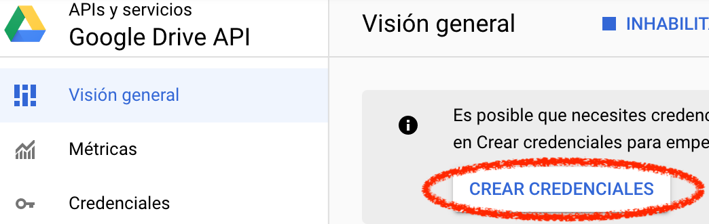
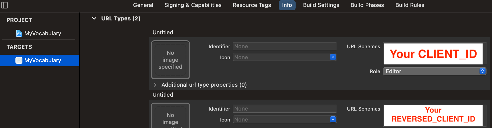

When I am reading a book in a foreign language, I use Google Translate to translate those words that I don't understand...

## Index

1. [Index](#index)
2. [Introduction](#introduction)
3. [First steps](#first-steps)
4. [Google Cloud Platform](#google-cloud-platform)
5. [URL Types configuration](#url-types-configuration)
6. [Google Sign In, SwiftUI implementation](#google-sign-in-swiftui-implementation)
7. [Don't upload API Keys to Git](#dont-upload-api-keys-to-git)
8. [Download spreadsheets from Google Drive](#download-spreadsheets-from-google-drive)
9. [Parse spreadsheet's translations](#parse-spreadsheets-translations)
10. [MVVM in SwiftUI](#mvvm-in-swiftui)
11. [Core Data in background](#core-data-in-background)
12. [Background and concurrent tasks in SwiftUI](#background-and-concurrent-tasks-in-swiftui)
13. [Accessibility - Dynamic Type](#accessibility)
14. [Accessibility - VoiceOver](#voiceover)
15. [Internationalization and localization](#internationalization-and-localization)

## Introduction

If I want to save some words, I mark them as favorites, pressing the star button for each word.


This is very useful because if I go to [https://translate.google.es/](https://translate.google.es/), I sign in with the same account and I can export that words into an XLSX file.

 

### So...

I want to build an app that downloads this file from Google Drive and helps me learn the words with games, Apple Watch complications, widgets, etc.

## First steps

I created an empty SwiftUI project with UIKit App Delegate life cycle.


Then, I added `GoogleSignIn` and `GoogleAPIClientForREST/Drive` libraries to it, using CocoaPods.

To add CocoaPods to a project, run `pod init` in its main directory. If you don't have `pod` installed on your computer, check [this](https://cocoapods.org/).

```
🙈 ~/Desktop/my-vocabulary/MyVocabulary$pod init
Ignoring ffi-1.12.2 because its extensions are not built. Try: gem pristine ffi --version 1.12.2
Ignoring sassc-2.3.0 because its extensions are not built. Try: gem pristine sassc --version 2.3.0
Ignoring unf_ext-0.0.7.7 because its extensions are not built. Try: gem pristine unf_ext --version 0.0.7.7
[!] Existing Podfile found in directory
```

In my case, `Podfile` already exists, but the first time you run this command, it'll be created.

The deployment target of my app is iOS 14.0, but your `Podfile` must look like mine.
```
platform :ios, '14.0'

target 'MyVocabulary' do
  use_frameworks!
  pod 'GoogleSignIn'
  pod 'GoogleAPIClientForREST/Drive'
end
```

These libraries are necessary because I will need to authenticate myself to access my Google Drive files.

Finish and run `pod install`.

```
🙈 ~/Desktop/my-vocabulary/MyVocabulary$pod install
Ignoring ffi-1.12.2 because its extensions are not built. Try: gem pristine ffi --version 1.12.2
Ignoring sassc-2.3.0 because its extensions are not built. Try: gem pristine sassc --version 2.3.0
Ignoring unf_ext-0.0.7.7 because its extensions are not built. Try: gem pristine unf_ext --version 0.0.7.7
Analyzing dependencies
Downloading dependencies
Installing AppAuth (1.4.0)
Installing GTMAppAuth (1.1.0)
Installing GTMSessionFetcher (1.5.0)
Installing GoogleAPIClientForREST (1.5.1)
Installing GoogleSignIn (5.0.2)
Generating Pods project
Integrating client project
Pod installation complete! There are 2 dependencies from the Podfile and 5 total pods installed.
```

Once you've installed CocoaPods, close your project, open Xcode again and select your **workspace**. This is very important, otherwise, your project won't build.


## Google Cloud Platform

The first thing that must be done is authentication with Google credentials to access Google Drive.

It's necessary a Google API Key.

1. Visit your Google Cloud Platform [dashboard](https://console.cloud.google.com/projectselector2/home/dashboard) and create a project.
2. Give a name to it.

    

3. Go to your APIs.

    

4. Enable Google Drive API.

    

5. Create credentials.

    

6. Configure OAuth screen.

    

7. Add testing emails, here you should add the Google account in which you have your translations. You will not be able to sign in during development with no registered testing emails.

    

8. Finish the configuration of your OAuth client.

    

9. In APIs and Services > Credentials, download the `plist` that contains `CLIENT_ID` and `REVERSED_CLIENT_ID`.

    

## URL Types configuration

Open the **workspace** of your project and go to Target > Info > **Url Types**.

You should add two **Url Types**, one with the value of the `CLIENT_ID` as URL Scheme and the other with the value of the `REVERSED_CLIENT_ID` of the downloaded file.



```xml
<?xml version="1.0" encoding="UTF-8"?>
<!DOCTYPE plist PUBLIC "-//Apple//DTD PLIST 1.0//EN" "http://www.apple.com/DTDs/PropertyList-1.0.dtd">
<plist version="1.0">
<dict>
    <key>CLIENT_ID</key>
    <string>xxxxxxxxxxxxx.apps.googleusercontent.com</string>
    <key>REVERSED_CLIENT_ID</key>
    <string>com.googleusercontent.apps.xxxxxxxxxxxxx</string>
    <key>PLIST_VERSION</key>
    <string>1</string>
    <key>BUNDLE_ID</key>
    <string>com.serg-ios.MyVocabulary</string>
</dict>
</plist>
```

Build the project, everything should work fine 🤞

## Google Sign In, SwiftUI implementation

<a name="didsignin">Google Sign In needs a delegate that will receive all the feedback of the process.</a>

```swift
import GoogleSignIn

class GoogleSignInDelegate: NSObject, GIDSignInDelegate, ObservableObject {
    func sign(_ signIn: GIDSignIn!, didSignInFor user: GIDGoogleUser!, withError error: Error!) {
        guard error == nil else {
            // Handle errors.
            return
        }
        print("Google Sign In - success")
    }
}
```

<a name="appdelegate">The singleton that handles the sign-in process needs the `clientID` property and its delegate to be setted, this must be done in the `didFinishLaunchingWithOptions` method of out `AppDelegate`.</a>

```swift
@main
class AppDelegate: UIResponder, UIApplicationDelegate {

    let googleSignDelegate = GoogleSignInDelegate()

    func application(_ application: UIApplication, didFinishLaunchingWithOptions launchOptions: [UIApplication.LaunchOptionsKey: Any]?) -> Bool {
        GIDSignIn.sharedInstance().clientID = "xxxxxxxxxxxxx.apps.googleusercontent.com"
        GIDSignIn.sharedInstance().delegate = googleSignDelegate
        return true
    }

    // ...
}
```

Now, the **Google Sign In** button must be implemented. We can create our own custom view but we are going to use the default one provided by Google. Unfortunately, this button is not available in SwiftUI, to use it `UIViewRepresentable` must be implemented.

```swift
import GoogleSignIn
import SwiftUI

struct GoogleSignInButton: UIViewRepresentable {

    @Environment(\.colorScheme) var colorScheme

    private var button: GIDSignInButton = GIDSignInButton()

    func makeUIView(context: Context) -> GIDSignInButton {
        button.colorScheme = self.colorScheme == .dark ? .dark : .light
        return button
    }

    func updateUIView(_ uiView: UIViewType, context: Context) {
        button.colorScheme = self.colorScheme == .dark ? .dark : .light
    }
}
```

Using `GIDSignInButton` is **not necessary** to call the `signIn` method manually.

```swift
GIDSignIn.sharedInstance()?.signIn()
```

You're almost ready to go, go to your `ContentView` and replace its default body implementation for this one...

```swift
struct ContentView: View {
    var body: some View {
        NavigationView {
            VStack {
                Spacer()
                GoogleSignInButton()
                    .frame(alignment: .center)
                    .padding(.horizontal, 50)
                    .navigationTitle("My Vocabulary")
            }
        }
    }
}
```

Now run the project, press the button that appears at the top of the screen and you'll see an error.

```
Terminating app due to uncaught exception 'NSInvalidArgumentException', 
reason: 'presentingViewController must be set.'
```

The Google Sign In singleton has the property `presentingViewController` that must refer to the view controller that will present the sign-in screen. To fix this, some changes must be done in our `SceneDelegate`.

```swift
import UIKit
import SwiftUI
import GoogleSignIn

class SceneDelegate: UIResponder, UIWindowSceneDelegate {

    var window: UIWindow?

    func scene(_ scene: UIScene, willConnectTo session: UISceneSession, options connectionOptions: UIScene.ConnectionOptions) {
        let googleSignDelegate = (UIApplication.shared.delegate as! AppDelegate).googleSignDelegate
        let contentView = ContentView()
        if let windowScene = scene as? UIWindowScene {
            let window = UIWindow(windowScene: windowScene)
            window.rootViewController = UIHostingController(rootView: contentView)
            // Set the window root view controller as the `GIDSignIn` presenting view controller.
            GIDSignIn.sharedInstance().presentingViewController = window.rootViewController
            self.window = window
            window.makeKeyAndVisible()
        }
    }

    // ...
}
```

Run the project, press the button again, and select an account that you included in the list "test emails" during the Google Cloud Platform configuration.

 

Look for this message in the Xcode logs...

```
Google Sign In - success
```

Hurray!! 🎉 🥳 🎊 

You have implemented the simplest sign-in with Google, no handling errors, no keeping session open after closing the app... But this will come later.

## Don't upload API Keys to Git

If you have a public repository you might want to hide your Google Sign-In Client ID.

Instead of hardcoding API keys into `Info.plist` or `AppDelegate`, they can be hidden in many ways, so they are not available in your repo.

Open the `xcconfig` files of your project.


```
MyVocabulary/Pods/Target\ Support\ Files/Pods-MyVocabulary/Pods-MyVocabulary.release.xcconfig
MyVocabulary/Pods/Target\ Support\ Files/Pods-MyVocabulary/Pods-MyVocabulary.debug.xcconfig
```

Append `REVERSED_CLIENT_ID` and `CLIENT_ID` at the end of both files (the name of the variables can be modified).

```
GOOGLE_SIGN_IN_REVERSED_CLIENT_ID=com.googleusercontent.apps.xxxxxxxxxxxxx
GOOGLE_SIGN_IN_CLIENT_ID=xxxxxxxxxxxxx.apps.googleusercontent.com
```

You don't want to upload these changes to your repo, so before doing `git add` of those files, you must indicate that changes in those files must not be taken into consideration.

```
git update-index --assume-unchanged MyVocabulary/Pods/Target\ Support\ Files/Pods-MyVocabulary/Pods-MyVocabulary.debug.xcconfig
git update-index --assume-unchanged MyVocabulary/Pods/Target\ Support\ Files/Pods-MyVocabulary/Pods-MyVocabulary.release.xcconfig
```

Note: If later you want to make changes into `xcconfig` files and upload them into your repo, remember to revert this.

```
git update-index --no-assume-unchanged <file>
```

Now, the variables can be used in the `Info.plist` doing `$(GOOGLE_SIGN_IN_CLIENT_ID)` and `$(GOOGLE_SIGN_IN_REVERSED_CLIENT_ID)`. Please, when adding the new URLTypes, give them an unique identifier.


We are almost there... Remember that the client ID was needed in the `AppDelegate` to be setted into `GIDSignIn.sharedInstance().clientID`? I made an extension of `Bundle` that obtains URLType's URL Schemes giving its identifier (see the previous step).

```swift
extension Bundle {
    static func urlScheme(urlTypeId: String) -> String? {
        (((main.infoDictionary?["CFBundleURLTypes"] as? [[String: Any]])?
            .first(where: { $0["CFBundleURLName"] as? String == urlTypeId}))?["CFBundleURLSchemes"] as? [String])?.first
    }
}
```

Instead of hardcoding the API key in the `AppDelegate`...

```swift
GIDSignIn.sharedInstance().clientID = Bundle.urlScheme(urlTypeId: "GOOGLE_SIGN_IN_CLIENT_ID")
```

## Download spreadsheets from Google Drive

A **scope** must be added to the Google Sign In [configuration](#appdelegate) in the App Delegate's `didFinishLaunchingWithOptions` method, to request the user permissions for accessing Google Drive files.

```swift
import GoogleAPIClientForREST
// ...
GIDSignIn.sharedInstance().scopes = [kGTLRAuthScopeDriveReadonly]
```

[Here](https://developers.google.com/drive/api/v3/reference/files/list) is the Google documentation for the Google Drive API requests that are needed.

A reference of the Google Drive service authorizer must be saved, add to the `GoogleSignInDelegate` a reference to the service.
```swift
private let googleDriveService = GTLRDriveService()
```
Then, in the implementation of [`didSignIn`](#didsignin), save the authorizer.
```swift
googleDriveService.authorizer = user.authentication.fetcherAuthorizer()
```

### Fetch all spreadsheets

A `GTLRDrive_FileList` will be downloaded using Google Drive's REST API query. This can also download files from Google Photos, for instance. In this case, only Drive files are needed, so the `spaces` and `corpora` properties must be set.
```swift
let query = GTLRDriveQuery_FilesList.query()
query.spaces = "drive"
query.corpora = "user"
```
 


By default, not all the fields of the `GTLRDrive_File` are fetched, indicate which ones must be requested.
```swift
query.fields = "files(id,name,modifiedTime,size)"
```
Also, tell the query to look only for spreadsheets.
```swift
let spreadsheetOnly = "mimeType = 'application/vnd.google-apps.spreadsheet'"
query.q = "\(spreadsheetOnly)"
```
Then, just execute the query and wait for the result, a `GTLRDrive_FileList`.
```swift
googleDriveService.executeQuery(query) { [weak self] _, result, error in
    guard error == nil else { return }
    for file in (result as? GTLRDrive_FileList)?.files ?? [] {
        // ...
    }
}
```
This query will return all the spreadsheets linked with that account, even those that are shared with other users or those that are in the Trash. Filters can be added, for instance, to fetch only files owned by the user and not other user's shared files.
```swift
let ownedByUser = "'\(email)' in owners"
query.q = "\(spreadsheetOnly) and \(ownedByUser)"
```
### Fetch the content of each spreadsheet

The previous query only fetched info about the files, to get the whole file, other requests must be made with the Google Drive service fetcher.

The ID of each spreadsheet must be included in the URL, in following example, replace the %@ with it.
```swift
private func spreadsheetUrl(id: String) -> URL? {
    URL(string: String(format: "https://www.googleapis.com/drive/v3/files/%@/export?alt=media&mimeType=application/vnd.openxmlformats-officedocument.spreadsheetml.sheet", id))
}
```
Use the URL to fetch the resource with Google Service.
```swift
googleDriveService.fetcherService.fetcher(with: url).beginFetch { [weak self] data, error in
    guard error == nil, let data = data else { return }
    // Handle the data
}
```

## Parse spreadsheet's translations

This is not as straightforward as fetching the data, to do this, there are libraries like [CoreXLSX](https://github.com/CoreOffice/CoreXLSX).

Adding it to your project is very simple with CocoaPods.
```
platform :ios, '14.0'

target 'MyVocabulary' do
  use_frameworks!
  # ...
  pod 'CoreXLSX'
end
```

### ♦️ Important

Before doing `pod install`, mark the `xcconfig` files as **no-assume-unchanged**.
```
git update-index --no-assume-unchanged MyVocabulary/Pods/Target\ Support\ Files/Pods-MyVocabulary/Pods-MyVocabulary.release.xcconfig
git update-index --no-assume-unchanged MyVocabulary/Pods/Target\ Support\ Files/Pods-MyVocabulary/Pods-MyVocabulary.debug.xcconfig
```

Then, install the new pod and you'll see that there are changes in that 2 files, check the files before uploading the changes (if you don't want to upload your API keys) and then upload them.

Now, the keys can be added again to the `xcconfig` files and the files must be marked again as **assume-unchanged**.
```
git update-index --assume-unchanged MyVocabulary/Pods/Target\ Support\ Files/Pods-MyVocabulary/Pods-MyVocabulary.debug.xcconfig
git update-index --assume-unchanged MyVocabulary/Pods/Target\ Support\ Files/Pods-MyVocabulary/Pods-MyVocabulary.release.xcconfig
```

To avoid uploading API Keys to your repo, do this every time you want to add a new library via CocoaPods.

### ♦️

Once installed the framework, here is how the rows of the spreadsheet can be accessed. Each row is an array of cells, this operation can throw several kinds of errors that can be handled.
```swift
import CoreXLSX
// ...
do {
    let file = try XLSXFile(data: data)
    guard let sharedStrings = try file.parseSharedStrings() else { return }
    let workbooks = try file.parseWorkbooks()
    for workbook in workbooks {
        let pathsAndNames = try file.parseWorksheetPathsAndNames(workbook: workbook)
        for (_, path) in pathsAndNames {
            let worksheet = try file.parseWorksheet(at: path)
            for row in worksheet.data?.rows ?? [] {
                let originLanguage = row[0]
                let aimLanguage = row[1]
                let originalText = row[2]
                let resultText = row[3]
                // ...
            }
        }
    }
} catch {
    // ...
}
```

And that's it! With this, you can read a spreadsheet from your Google Drive and use the data in your app.

## MVVM in SwiftUI

To isolate the business logic from view, this is a useful pattern. The view will be reactive to an observable status in the view model.

### Import spreadsheets

The main view will contain the list of spreadsheets and the sign-in / out buttons. Each spreadsheet is represented by another view, that contains information about the spreadsheet and a button to import all the words from it.


Main view status:
```swift
enum Status {
    case off
    case loading
    case loaded(spreadsheets: [Spreadsheet])
}
```
Spreadsheet view status:
```swift
enum Status {
    case importable
    case imported
}
```
Status property must be inside a view model and each view will have its own, for example:
```swift
extension ImportView {
    class ViewModel: NSObject, ObservableObject {

        enum Status {
            case off
            case loading
            case loaded(spreadsheets: [Spreadsheet])
        }

        @Published private(set) var status: Status = .off
    }
}
```
To use the view model from the view:
```swift
struct ImportView: View {

    @StateObject private var viewModel: ViewModel

    init(viewModel: ViewModel) {
        _viewModel = StateObject(wrappedValue: viewModel)
    }
}
```

In summary:

- The view model must be a class that implements `ObservableObject`.
- The properties that will be observed, must be marked as `@Published`.
- The view model must be a `@StateObject` in the view.
- The view model must be initialized using the `StateObject(wrappedValue:)` initializer.

After doing this, the view model's status can be observed from the view:
```swift
var body: some View {
    NavigationView {
        if case .loading = viewModel.status {
            // ...
        } else if case .loaded(let spreadsheets) = viewModel.status {
            // ...
        } else {
            // ...
        }
    }
}
```

#### Bindings

After importing the words in a spreadsheet into the app, the fetched translations will be updated and each spreadsheet must indicate if its translations can be imported or if they have already been imported.

From the main view model, all the imported translations are fetched:
```swift
class ViewModel: NSObject, ObservableObject {

    // ...

    private let dataController: DataController
    private let translationsController: NSFetchedResultsController<Translation>

    @Published var translations: [Translation] = []

    // ...

    init(dataController: DataController, /* ... */) {
        self.dataController = dataController
        // ...
        let request: NSFetchRequest<Translation> = Translation.fetchRequest()
        request.sortDescriptors = []
        translationsController = NSFetchedResultsController(
            fetchRequest: request,
            managedObjectContext: dataController.container.viewContext,
            sectionNameKeyPath: nil,
            cacheName: nil
        )
        super.init()
        translationsController.delegate = self
        try? translationsController.performFetch()
        translations = translationsController.fetchedObjects ?? []
    }
}
```
The view model becomes the delegate of the `NSFetchedResultsController`, receiving the the new fetched translations every time they are updated:
```swift
extension ImportView.ViewModel: NSFetchedResultsControllerDelegate {
    func controllerDidChangeContent(_ controller: NSFetchedResultsController<NSFetchRequestResult>) {
        if let newTranslations = controller.fetchedObjects as? [Translation] {
            translations = newTranslations
        }
    }
}
```
The fetched translations are marked as `@Published`, so changes in the array will be notified to all its observers. From the main view, each time a spreadsheet view is created, the binding to the `@Published` translations is passed:
```swift
ForEach(spreadsheets, id: \.id) { spreadsheet in
    SpreadsheetView(
        translations: $viewModel.translations,
        viewModel: .init(spreadsheet: spreadsheet) {
            viewModel.importTranslations(from: spreadsheet)
        }
    )
    .padding()
}
```
To update the spreadsheet's view reactively with translation's changes, the published value must be bound:
```swift
struct SpreadsheetView: View {

    @Binding var translations: [Translation]

    // ...

    init(translations: Binding<[Translation]>, /* ... */) {
        self._translations = translations
        //...
    }
```
Every time the translations are updated, each spreadsheet checks if its translations have been imported. If this is the case, the status of the spreadsheet's view becomes `imported`.

## Core Data in background

Saving just one or two items in Core Data is trivial, but when we need to store thousands of elements, the app can get stuck while all these items are added.

### Why must run in background?

```swift
for translation in spreadsheet.translations {
    guard self?.hasBeenImported(translation, in: translations) == true else { continue }
    let newTranslation = Translation(context: context)
    newTranslation.from = translation.from
    newTranslation.to = translation.to
    newTranslation.input = translation.input
    newTranslation.output = translation.output
}
```

This code works great for adding a few translations, but...

1. What would happen in the example above if the spreadsheet has 10.000 translations?
2. The `hasBeenImported` guard, verifies that the translation that is going to be added hasn't been added already. What happens when 20.000 translations have already been added?

### How to add thousands of items in background?

Running that code directly in the background using `DispatchQueue.global(qos: .background).async { /* ...*/ }` doesn't work for Core Data, to store the translations `performBackgroundTask` must be called on the `NSPersistentCloudKitContainer` to generate a new `NSManagedObjectContext` that will be able to perform background tasks.

```swift
func importTranslations(from spreadsheet: Spreadsheet, alreadyImported translations: [Translation]) {
    dataController.container.viewContext.automaticallyMergesChangesFromParent = true
    dataController.container.performBackgroundTask { [weak self] context in
    for translation in spreadsheet.translations {
        guard self?.hasBeenImported(translation, in: translations) == true else { continue }
        let newTranslation = Translation(context: context)
        newTranslation.from = translation.from
        newTranslation.to = translation.to
        newTranslation.input = translation.input
        newTranslation.output = translation.output
    }
    try? context.save()
}
```

There are 2 important lines in the code above:

1. Setting `dataController.container.viewContext.automaticallyMergesChangesFromParent = true`, the main context of the container (`viewContext`) will receive the changes immediately, even if the items are being written in other context.

2. The changes must be saved, but in the new context, with `try? context.save()`.

In other parts of the app, the translations are being fetched and the `NSFetchedResultsControllerDelegate` must respond to content changes.

```swift
extension ContentView {
    class ViewModel: NSObject, ObservableObject {

        @Published var translations: [Translation] = []

        let dataController: DataController
        private var translationsController: NSFetchedResultsController<Translation>

        init(dataController: DataController) {
            self.dataController = dataController
            let request: NSFetchRequest<Translation> = Translation.fetchRequest()
            request.sortDescriptors = []
            translationsController = NSFetchedResultsController(
                fetchRequest: request,
                managedObjectContext: dataController.container.viewContext,
                sectionNameKeyPath: nil,
                cacheName: nil
            )
            super.init()
            translationsController.delegate = self
            try? translationsController.performFetch()
            translations = translationsController.fetchedObjects ?? []
        }

    }
}

// MARK: - NSFetchedResultsControllerDelegate methods

extension ContentView.ViewModel: NSFetchedResultsControllerDelegate {
    func controllerDidChangeContent(_ controller: NSFetchedResultsController<NSFetchRequestResult>) {
        if let newTranslations = controller.fetchedObjects as? [Translation] {
            translations = newTranslations
        }
    }
}
```

As the fetched translations are `@Published`, all the views that would like to update responsively to changes in translations, must bind and observe them with `onChange`.

```swift
struct SpreadsheetView: View {

    @Binding private var translations: [Translation]
    
    var body: some View {
        VStack {
            // ...
        }
        .onChange(of: translations) { newTranslations in
            viewModel.checkIfImported(translations: newTranslations)
        }
    }
}
```

## Background and concurrent tasks in SwiftUI

For other kinds of background tasks in SwiftUI, for which the view must be updated after the task finishes. A `@State` or `@Published` property can be modified when the task is completed, but it is very important to do this in the main thread because everything that causes a UI update must be run in the main thread.

```swift
extension SpreadsheetView {
    class ViewModel: NSObject, ObservableObject {

        enum Status {
            case loading
            case importable
            case imported
        }

        @Published var status: Status = .loading

        func checkIfImported(translations: [Translation]) {
            DispatchQueue.global(qos: .background).async { [weak self] in
                for translation in self?.spreadsheet.translations ?? [] {
                    if !translations.contains(where: { $0.id == translation.id }) {
                        DispatchQueue.main.async { [weak self] in
                            self?.status = .importable // Will make the UI react, do it in main thread.
                        }
                        return
                    }
                }
                DispatchQueue.main.async { [weak self] in
                    self?.status = .imported // Will make the UI react, do it in main thread.
                }
            }
        }
    }
}
```

### Parsing spreadsheets concurrently

Parsing spreadsheets is a very demanding task that can take several seconds to complete, it is a good idea to parse all the spreadsheets concurrently to save some time.

```swift
func fetchAllSpreadsheets(completion: @escaping () -> ()) {
    // ...
    for file in (result as? GTLRDrive_FileList)?.files ?? [] {
        if let id = file.identifier, let name = file.name {
            self?.dispatchGroup.enter()
            print("Start fetching & parsing spreadsheet \(id)")
            self?.fetchSpreadsheet(id: id, name: name)
        }
    }
    self?.dispatchGroup.notify(queue: .main) { [weak self] in
        self?.spreadsheetsResult = .success(self?.spreadsheets ?? [])
        completion()
    }
}

func fetchSpreadsheet(id: String, name: String) {
    guard let url = spreadsheetUrl(id: id) else {
        dispatchGroup.leave()
        return
    }
    // Fetches and parses the content of each spreadsheet, given its ID.
    googleDriveService.fetcherService.fetcher(with: url).beginFetch { [weak self] data, error in
        guard error == nil, let data = data else {
            self?.dispatchGroup.leave()
            return
        }
        DispatchQueue.global(qos: .background).async { [weak self] in
            self?.generateSpreadsheet(from: data, id: id, name: name)
            self?.dispatchGroup.leave()
            print("Finish fetching & parsing spreadsheet \(id)")
        }
    }
}
```

#### DispatchGroup

Using `DispatchGroup` is a great choice because it is very easy to use. By calling `dispatchGroup.enter()` before every demanding task starts and `dispatchGroup.leave()` when it ends, when all the `dispatchGroup.leave()`'s have been called, the `self?.dispatchGroup.notify(queue: .main) { /* ... */ }` is executed.

Remember, if UI is going to be updated by the `notify` closure, it must run in the main thread.

In the code above, some `print` was added to see that the concurrent tasks may end in a different order to one in which they started.

```
Start fetching & parsing spreadsheet 1n4nY49aEwCGocULrdMWrhFr1JjKX5hxFjEssHKoEgIQ
Start fetching & parsing spreadsheet 1c6PcEbF65JgM_SU3rGxLe2Y1um_e7c5hNVIMZJ624S4
Start fetching & parsing spreadsheet 1zUDkpLmfgDUH4OfEferFQWT0R97HsX85ZKN8T0KibJg
Start fetching & parsing spreadsheet 11CWqCmMTK_Gy5ssT5ibZjkAirhkNeUZAH5sDshBqfFc

Finish fetching & parsing spreadsheet 1zUDkpLmfgDUH4OfEferFQWT0R97HsX85ZKN8T0KibJg
Finish fetching & parsing spreadsheet 11CWqCmMTK_Gy5ssT5ibZjkAirhkNeUZAH5sDshBqfFc
Finish fetching & parsing spreadsheet 1n4nY49aEwCGocULrdMWrhFr1JjKX5hxFjEssHKoEgIQ
Finish fetching & parsing spreadsheet 1c6PcEbF65JgM_SU3rGxLe2Y1um_e7c5hNVIMZJ624S4
```


## Accessibility

It´s very important to make the app usable to everybody, a voice can describe whatever happens on the screen, vibrations (haptics) can give information about an action, different text sizes can be supported...

### Dynamic Type

Some people need bigger fonts to be able to read the texts on the screen, there are a lot of apps out there that don't support the **Dynamic Type** feature.

For texts in SwiftUI, the simplest way of doing it is applying the view modifier `font` with any of the default fonts:

```swift
// ...
.font(.title2)
.font(.title3)
.font(.footnote)
.font(.largeTitle)
// ...
```

These are the ones I used, but there are many [more](https://developer.apple.com/documentation/swiftui/font).


When the font increases its size, some texts need more than one line to be represented, to limit the number of lines, use the view modifier `.lineLimit(1)`.

For those texts that must not be truncated, `.minimumScaleFactor(0.1)` can be used, so the font size scales accordingly to the factor if it doesn't fit in the available space.

But dynamic sizes don't apply exclusively to texts, images, and other views can become bigger too, according to the user settings:

- By giving them a fixed size, they won't grow nor shrink. 
- By using a minimum size and no maximum, for example, views can grow indefinitely and shrink down to a limit, just use the view modifier `.frame(minWidth: 44, minHeight: 44)`.


The size of the texts and views can be changed in runtime from Xcode.

### VoiceOver

iOS can describe what's happening on screen to users with eyesight problems, to activate this functionality, just ask Siri.

> Hey Siri, activate VoiceOver

Or, if you want, you can navigate through _Settings > Accessibility > VoiceOver_.

#### Navigation

To navigate through the screen using VoiceOver, specific gestures must be used:

- Swipe left/right with 1 finger to select and read the previous/next accessibility element.
- Tap an accessibility element with 1 finger to select and read it.
- Double-tap anywhere in the screen with 1 finger to execute the action associated with the selected accessibility element.
- Swipe up/down/left/right with 3 fingers to scroll.
- Tap with 4 fingers in the top/bottom half of the screen to select and read the first/last accessibility element.

#### Group accessibility elements

Any view can be an accessibility element, but some views must not be read by VoiceOver because too much useless information can be annoying, especially with complicated views with multiple children.


To avoid this, a view can be considered a group whose children must be ignored, giving a label to the whole set.

```swift
.accessibilityElement(children: .ignore)
.accessibilityLabel("Description of the view")
```


#### Problem with toolbar items in SwiftUI

Presently, there is a problem with SwiftUI's toolbar items accessibility labels. 

A workaround to solve it is to use text instead of an image, VoiceOver will read the text directly.

```swift
if UIAccessibility.isVoiceOverRunning {
    Text("Delete all imported translations")
} else {
    Image(systemName: "xmark.bin")
}
```

#### More info

To provide more information about an accessibility element, use `accessibilityHint`.

```swift
.accessibilityHint("Double tap to reveal the translation.")
```

VoiceOver will read the hint after the label, with a long pause between them.

#### Action

Some accessibility elements have no associated action, so when the user double-taps them, nothing happens.

To associate an action to an accessibility element, use `accessibilityAction`.

```swift
.accessibilityAction {
    viewModel.importTranslations()
}
```

## Internationalization and localization

Internationalization and localization are two different concepts, the former makes your app support other languages and the latter adds languages to the app.

### Internationalization

To make an app support different languages easily, some configurations must be made first.

To identify the texts that are not localized, open the "Run options" menu `⌥ + ⌘ + r` and check "Show non localized strings".


This will uppercase every text that has not been localized, with some exceptions:

- Those texts that are obtained from the model (user data) won't be localized, take a look at the translated words and phrases in the screenshot below.
- Texts that are calculated programmatically, instead of being hardcoded directly, take a look at the word "Filter".


```swift
    // ...
    private var placeholder: String

    init(placeholder: String, /* ... */) {
        self.placeholder = placeholder
        // ...
    }
    
    var body: some View {
        VStack(alignment: .leading) {
            HStack {
                TextField(placeholder, text: $searchString)
    // ...
```

#### Localizable.strings

Initially, I added all the strings in English, now I am going to support another language, Spanish.

First of all, add a `Localizable.strings` file to your project.


In the main directory of your project, run in Terminal:
```bash
find . -name "*.swift" | xargs genstrings -SwiftUI -o ~/Desktop/
```
This command will generate another `Localizable.strings` file and it will place it in the desktop, just copy/paste its content into the `Localizable.strings` of the project. 

Run the app again, the texts are not uppercased anymore. That means that is localized!

#### Errors

Some texts may not be included in the `Localizable.strings` file, for example, the word "Filter" should not be included in it as it was not uppercased in the previous step.

The solution is to use `LocalizedStringKey` instead of `String` to pass strings as parameters that must be translated.

```swift
    // ...
    private var placeholder: LocalizedStringKey

    init(placeholder: LocalizedStringKey, /* ... */) {
        self.placeholder = placeholder
        // ...
    }
    
    var body: some View {
        VStack(alignment: .leading) {
            HStack {
                TextField(placeholder, text: $searchString)
    // ...
```

Now, run again the app and check that the word is not uppercased anymore. Xcode logs should print:

```
[strings] ERROR: Filter not found in table Localizable of bundle CFBundle
```

To solve this, the only solution is to add manually the string to the `Localizable.strings` file:

```
"Filter" = "Filter";
```

#### Plurals

A string went unnoticed because it was uppercased before the `Show non-localized strings` option was checked:

```swift
var numberOfTranslationsString: String {
    String(format: "%d translations", translations.count).localizedUppercase
}
```

It wasn't included in the `Localizable.strings` file but it did not appear in the Xcode logs either. Doing this:

```swift
/// Text that expresses the number of translations that contains the spreadsheet.
var numberOfTranslationsString: String {
    String(format: NSLocalizedString("%d translations", comment: ""), translations.count)
}
```

The `localizedUppercase` has been removed but, running the app, the string is still in capital letters. At least, the system is noticing that the string is not localized, thanks to the `NSLocalizedString`.

But what does this string have to do with **plurals**? Well, each spreadsheet can have a different number of translations and the text is not the same for 1 than for 2 or more, a lot of languages work like this:

```swift
1 TRANSLATION
2 TRANSLATIONS // As you see, there is a difference, not only on the number.
```

To support plurals, add a `stringsdict` file:


Open it as an XML file:


It must contain this:

```xml
<?xml version="1.0" encoding="UTF-8"?>
<!DOCTYPE plist PUBLIC "-//Apple//DTD PLIST 1.0//EN" "http://www.apple.com/DTDs/PropertyList-1.0.dtd">
<plist version="1.0">
<dict>
    <key>`StringKey`</key>
    <dict>
        <key>NSStringLocalizedFormatKey</key>
        <string>%#@VARIABLE@</string>
        <key>VARIABLE</key>
        <dict>
            <key>NSStringFormatSpecTypeKey</key>
            <string>NSStringPluralRuleType</string>
            <key>NSStringFormatValueTypeKey</key>
            <string></string>
            <key>zero</key>
            <string></string>
            <key>one</key>
            <string></string>
            <key>two</key>
            <string></string>
            <key>few</key>
            <string></string>
            <key>many</key>
            <string></string>
            <key>other</key>
            <string></string>
        </dict>
    </dict>
</dict>
</plist>
```

After replacing `StringKey` with the actual key, in this case is `%d translations`, adding `d` as the string for `NSStringFormatValueTypeKey`...

```xml
<key>NSStringFormatValueTypeKey</key>
<string>d</string>
```

... and adding a string for the cases `zero`, `one`, and `other` ...

```xml
<key>zero</key>
<string>No translations</string>
<key>one</key>
<string>1 translation</string>
<key>other</key>
<string>%d translations</string>
```

This is the result! 😁


At this point, the app is fully internationalized.

### Localization

Go to `Project > Info tab > Localizations > + > Language`, in my case, I added Spanish, so it looks like this:


By unfolding `Localizable.strings`, both languages appear. Opening the second language file and replacing the texts will localize the app!


```swift
"Delete all imported translations" = "Borrar todas las traducciones importadas"; // For example
```

#### stringsdict

For plurals is a bit different. The `Localizable.stringsdict` file must be selected to open its _File inspector_, you can use the shortcut `⌥ + ⌘ + 0`. By selecting `Localize`, Xcode will prompt which language must be supported, after selecting one, it should look like this:


As done in `Localizable.strings`, the texts must be replaced to match the new language. But the key `StringKey` must remain the same.

#### Accessibility

In the previous section, where I talked about accessibility, some accessibility labels had this format:

```swift
.accessibilityLabel("\(translation.translationInput) in \(translation.translationFrom), \(translation.translationOutput) in \(translation.translationTo) . Level \(translation.level).")
```

This kind of strings, must be added with placeholders to the `Localizable.strings` file and everything should work fine:

```swift
"%@ in %@, %@ in %@ . Level %d." = "%@ en %@, %@ en %@ . Nivel %d.";
```

Always remember to translate all the `accessibilityLabel` and `accesibilityHint` 😁

**To be continued...**
