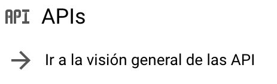
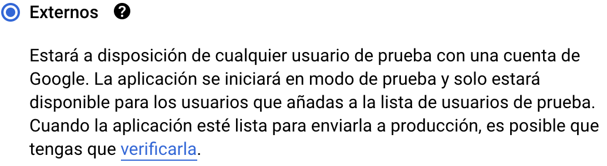
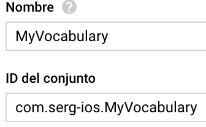

The first thing that must be done is authentication with Google credentials to access Google Drive, a **Google API Key** it's necessary .

1️⃣ Visit your Google Cloud Platform [dashboard](https://console.cloud.google.com/projectselector2/home/dashboard) and create a project.

2️⃣ Give a name to it.

3️⃣ Go to your APIs.

4️⃣ Enable Google Drive API.

5️⃣ Create credentials.

6️⃣ Configure OAuth screen.

7️⃣ Add testing emails, here you should add the Google account in which you have your translations. You will not be able to sign in during development with no registered testing emails.

8️⃣ Finish the configuration of your OAuth client.

9️⃣ In APIs and Services > Credentials, download the plist that contains `CLIENT_ID` and `REVERSED_CLIENT_ID`.

---

