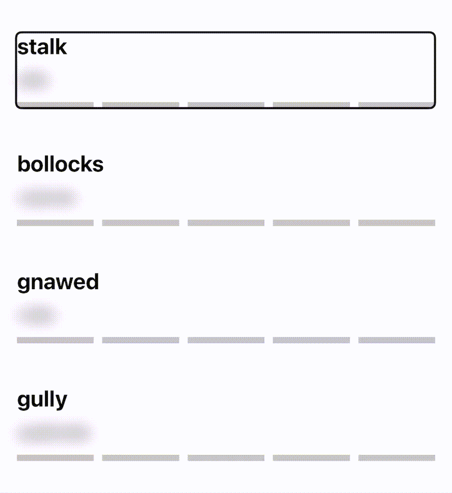

iOS can describe what's happening on screen to users with eyesight problems, to activate this functionality, just ask Siri.

> Hey Siri, activate VoiceOver

Or, if you want, you can navigate through _Settings > Accessibility > VoiceOver_.

### Navigation

To navigate through the screen using VoiceOver, specific gestures must be used:

- Swipe left/right with 1 finger to select and read the previous/next accessibility element.
- Tap an accessibility element with 1 finger to select and read it.
- Double-tap anywhere in the screen with 1 finger to execute the action associated with the selected accessibility element.
- Swipe up/down/left/right with 3 fingers to scroll.
- Tap with 4 fingers in the top/bottom half of the screen to select and read the first/last accessibility element.

### Group accessibility elements

Any view can be an accessibility element, but some views must not be read by VoiceOver because too much useless information can be annoying, especially with complicated views with multiple children.


To avoid this, a view can be considered a group whose children must be ignored, giving a label to the whole set.

```swift
.accessibilityElement(children: .ignore)
.accessibilityLabel("Description of the view")
```



### Problem with toolbar items in SwiftUI

Presently, there is a problem with SwiftUI's toolbar items accessibility labels. 

A workaround to solve it is to use text instead of an image, VoiceOver will read the text directly.

```swift
if UIAccessibility.isVoiceOverRunning {
    Text("Delete all imported translations")
} else {
    Image(systemName: "xmark.bin")
}
```

### More info

To provide more information about an accessibility element, use `accessibilityHint`.

```swift
.accessibilityHint("Double tap to reveal the translation.")
```

VoiceOver will read the hint after the label, with a long pause between them.

### Action

Some accessibility elements have no associated action, so when the user double-taps them, nothing happens.

To associate an action to an accessibility element, use `accessibilityAction`.

```swift
.accessibilityAction {
    viewModel.importTranslations()
}
```


---

