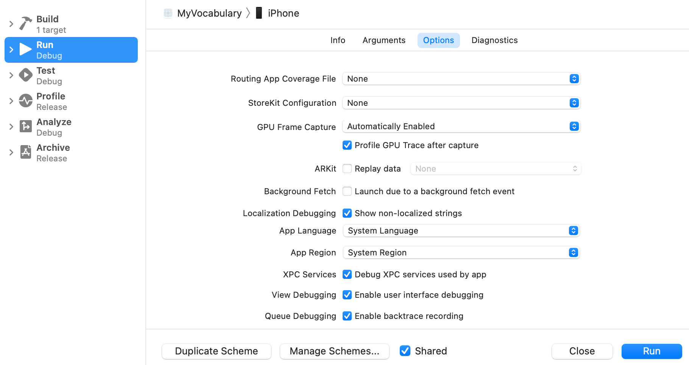
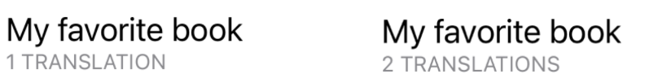
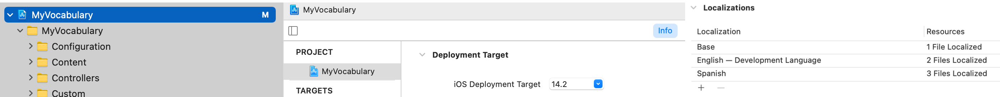

Internationalization and localization are two different concepts, the former makes your app support other languages and the latter adds languages to the app.

### Internationalization

To make an app support different languages easily, some configurations must be made first.

To identify the texts that are not localized, open the "Run options" menu `⌥ + ⌘ + r` and check "Show non localized strings".



This will uppercase every text that has not been localized, with some exceptions:

- Those texts that are obtained from the model (user data) won't be localized, take a look at the translated words and phrases in the screenshot below.
- Texts that are calculated programmatically, instead of being hardcoded directly, take a look at the word "Filter".


```swift
    // ...
    private var placeholder: String

    init(placeholder: String, /* ... */) {
        self.placeholder = placeholder
        // ...
    }
    
    var body: some View {
        VStack(alignment: .leading) {
            HStack {
                TextField(placeholder, text: $searchString)
    // ...
```

#### Localizable.strings

Initially, I added all the strings in English, now I am going to support another language, Spanish.

First of all, add a `Localizable.strings` file to your project.


In the main directory of your project, run in Terminal:
```bash
find . -name "*.swift" | xargs genstrings -SwiftUI -o ~/Desktop/
```
This command will generate another `Localizable.strings` file and it will place it in the desktop, just copy/paste its content into the `Localizable.strings` of the project. 

Run the app again, the texts are not uppercased anymore. That means that is localized!

#### Errors

Some texts may not be included in the `Localizable.strings` file, for example, the word "Filter" should not be included in it as it was not uppercased in the previous step.

The solution is to use `LocalizedStringKey` instead of `String` to pass strings as parameters that must be translated.

```swift
    // ...
    private var placeholder: LocalizedStringKey

    init(placeholder: LocalizedStringKey, /* ... */) {
        self.placeholder = placeholder
        // ...
    }
    
    var body: some View {
        VStack(alignment: .leading) {
            HStack {
                TextField(placeholder, text: $searchString)
    // ...
```

Now, run again the app and check that the word is not uppercased anymore. Xcode logs should print:

```
[strings] ERROR: Filter not found in table Localizable of bundle CFBundle
```

To solve this, the only solution is to add manually the string to the `Localizable.strings` file:

```
"Filter" = "Filter";
```

#### Plurals

A string went unnoticed because it was uppercased before the `Show non-localized strings` option was checked:

```swift
var numberOfTranslationsString: String {
    String(format: "%d translations", translations.count).localizedUppercase
}
```

It wasn't included in the `Localizable.strings` file but it did not appear in the Xcode logs either. Doing this:

```swift
/// Text that expresses the number of translations that contains the spreadsheet.
var numberOfTranslationsString: String {
    String(format: NSLocalizedString("%d translations", comment: ""), translations.count)
}
```

The `localizedUppercase` has been removed but, running the app, the string is still in capital letters. At least, the system is noticing that the string is not localized, thanks to the `NSLocalizedString`.

But what does this string have to do with **plurals**? Well, each spreadsheet can have a different number of translations and the text is not the same for 1 than for 2 or more, a lot of languages work like this:

```swift
1 TRANSLATION
2 TRANSLATIONS // As you see, there is a difference, not only on the number.
```

To support plurals, add a `stringsdict` file:


Open it as an XML file:


It must contain this:

```xml
<?xml version="1.0" encoding="UTF-8"?>
<!DOCTYPE plist PUBLIC "-//Apple//DTD PLIST 1.0//EN" "http://www.apple.com/DTDs/PropertyList-1.0.dtd">
<plist version="1.0">
<dict>
    <key>`StringKey`</key>
    <dict>
        <key>NSStringLocalizedFormatKey</key>
        <string>%#@VARIABLE@</string>
        <key>VARIABLE</key>
        <dict>
            <key>NSStringFormatSpecTypeKey</key>
            <string>NSStringPluralRuleType</string>
            <key>NSStringFormatValueTypeKey</key>
            <string></string>
            <key>zero</key>
            <string></string>
            <key>one</key>
            <string></string>
            <key>two</key>
            <string></string>
            <key>few</key>
            <string></string>
            <key>many</key>
            <string></string>
            <key>other</key>
            <string></string>
        </dict>
    </dict>
</dict>
</plist>
```

After replacing `StringKey` with the actual key, in this case is `%d translations`, adding `d` as the string for `NSStringFormatValueTypeKey`...

```xml
<key>NSStringFormatValueTypeKey</key>
<string>d</string>
```

... and adding a string for the cases `zero`, `one`, and `other` ...

```xml
<key>zero</key>
<string>No translations</string>
<key>one</key>
<string>1 translation</string>
<key>other</key>
<string>%d translations</string>
```

This is the result! 😁



At this point, the app is fully internationalized.

### Localization

Go to `Project > Info tab > Localizations > + > Language`, in my case, I added Spanish, so it looks like this:



By unfolding `Localizable.strings`, both languages appear. Opening the second language file and replacing the texts will localize the app!


```swift
"Delete all imported translations" = "Borrar todas las traducciones importadas"; // For example
```

#### stringsdict

For plurals is a bit different. The `Localizable.stringsdict` file must be selected to open its _File inspector_, you can use the shortcut `⌥ + ⌘ + 0`. By selecting `Localize`, Xcode will prompt which language must be supported, after selecting one, it should look like this:


As done in `Localizable.strings`, the texts must be replaced to match the new language. But the key `StringKey` must remain the same.

#### Accessibility

In the previous section, where I talked about accessibility, some accessibility labels had this format:

```swift
.accessibilityLabel("\(translation.translationInput) in \(translation.translationFrom), \(translation.translationOutput) in \(translation.translationTo) . Level \(translation.level).")
```

This kind of strings, must be added with placeholders to the `Localizable.strings` file and everything should work fine:

```swift
"%@ in %@, %@ in %@ . Level %d." = "%@ en %@, %@ en %@ . Nivel %d.";
```

Always remember to translate all the `accessibilityLabel` and `accesibilityHint` 😁


---

