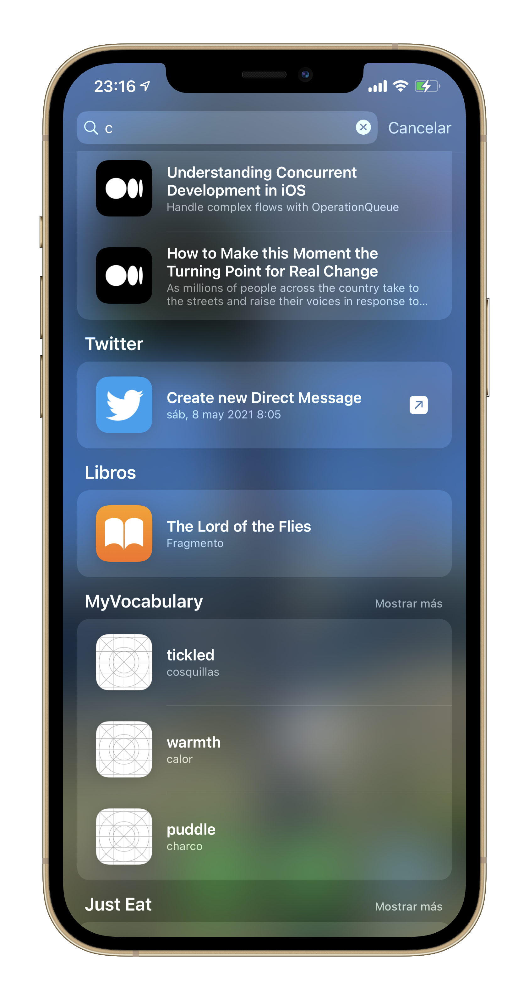

Supporting this Apple feature is very useful and improves user experience.



### Create a Spotlight item

When the user answers a question at the translation's quiz, that translation can be stored in Spotlight so it can be reviewed easily.

```swift
/// Updates a translation in CloudKit and adds it to Spotlight.
/// - Parameter translation: The translation that will be updated.
func update(_ translation: Translation) {
    let translationID = translation.objectID.uriRepresentation().absoluteString
    let attributeSet = CSSearchableItemAttributeSet(contentType: .text)
    attributeSet.title = translation.translationInput
    attributeSet.contentDescription = translation.translationOutput
    let searchableItem = CSSearchableItem(
        uniqueIdentifier: translationID,
        domainIdentifier: "com.serg-ios.MyVocabulary",
        attributeSet: attributeSet
    )
    CSSearchableIndex.default().indexSearchableItems([searchableItem])
    save()
}
```

Please, note that this is a very basic Spotlight item, they are much more customizable but I decided to use only the fields `title` and `contentDescription`.

The `uniqueIdentifier` identifies univocally the item, note that an `NSManagedObjectID` is being used to make the translation retrievable from the `NSManagedObjectContext` once the user has selected the Spotlight item. I didn't implement this though, I decided to provide the default action (launching the app).

### Delete Spotlight data

The `domainIdentifier` groups all the items that have this field in common, so they can be deleted together at once.

An item can be deleted individually too, but I didn't implement this. All Spotlight items are removed at once when the user deletes all the imported translations.

```swift
/// Delete all the objects of a specific type from iCloud and removes all Spotlight data.
/// - Parameter objectType: The type of the objects that will be removed.
func deleteAll(_ objectType: NSManagedObject.Type) {
    let fetchRequest: NSFetchRequest<NSFetchRequestResult> = objectType.fetchRequest()
    let batchDeleteRequest = NSBatchDeleteRequest(fetchRequest: fetchRequest)
    _ = try? container.viewContext.executeAndMergeChanges(using: batchDeleteRequest)
    CSSearchableIndex.default().deleteSearchableItems(withDomainIdentifiers: ["com.serg-ios.MyVocabulary"])
}
```

### Attach a NSManagedObject to  a CSSearchableItem

[Here](/2021-03-21-my-vocabulary-spotlight/), an **uniqueIdentifier** was attached to the `CSSearchableItem`, so it could be retrievable when the app is open through Spotlight.

The reverse operation has to be made, this time from ID to object.
```swift
/// Tries to obtain a stored translation with its object ID.
/// - Parameter uniqueIdentifier: The object ID of the managed object, a translation in this case.
/// - Returns: The translation that has that object ID.
func translation(with uniqueIdentifier: String) -> Translation? {
    guard let url = URL(string: uniqueIdentifier),
          let id = container.persistentStoreCoordinator.managedObjectID(forURIRepresentation: url) else {
        return nil
    }
    return try? container.viewContext.existingObject(with: id) as? Translation
}
```

See how to obtain this ID when the [app opens](/2021-03-25-my-vocabulary-open-the-app/).

---

