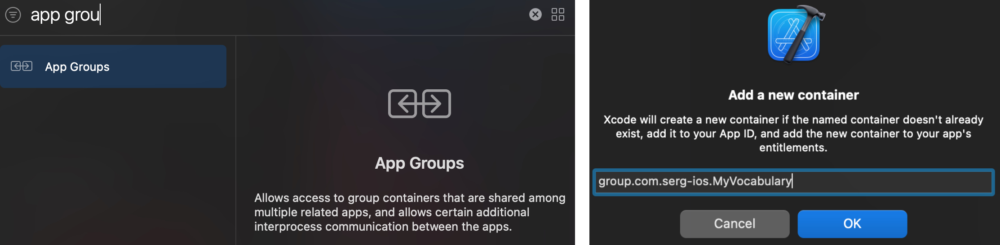
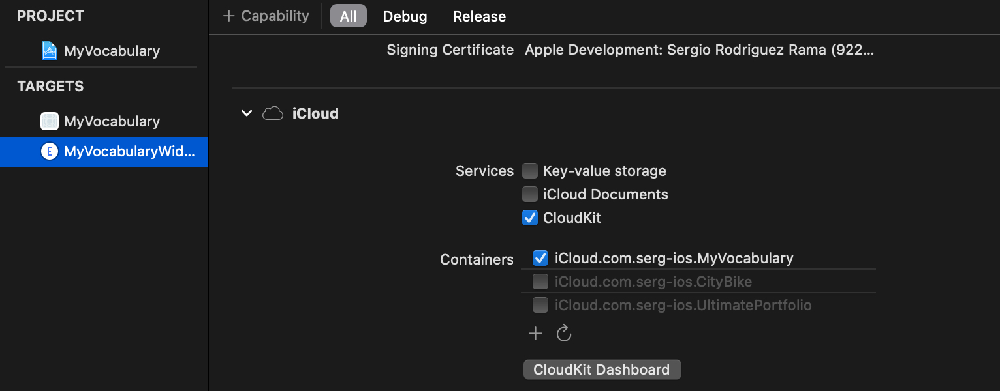

I built a simple widget that shows a random translation, every 5 seconds the translation changes and shows a new one.


### Target

To support widgets, a new target must be created.


Some elements are needed both by the widget target and the app. For example, in `MyVocabularyWidget.swift` I needed to access several elements from the app...

```swift
struct Provider: TimelineProvider {
    var mockEntry: SimpleEntry {
        SimpleEntry(
            date: Date(),
            // I need Translation.
            translation: Translation.example(viewContext: DataController.preview.container.viewContext)
        )
    }
    // ...
    private func loadTranslations() -> [Translation] {
        // I need DataController
        DataController().translationsForWidget()
    }
    // ...
```

... be sure that the files are accessible from both targets, otherwise the project won't build.


### Core data

To access the translations from the widget target, I need access to Core Data. So an App Group is needed, both targets (app and widget) must have access to this group and iCloud.

In both targets, add the new capability...



... remember to add the iCloud capability too in the widget target.



The URL in which the data will be stored must be relative to the App Group, so the `persistentStoreDescription`'s first URL must be changed...

```swift
if inMemory {
    container.persistentStoreDescriptions.first?.url = URL(fileURLWithPath: "/dev/null")
} else {
    let groupID = "group.com.serg-ios.MyVocabulary"
    if let url = FileManager.default.containerURL(forSecurityApplicationGroupIdentifier: groupID) {
        container.persistentStoreDescriptions.first?.url = url.appendingPathComponent("Main.sqlite")
    }
}
```

... after doing this, remove all the data stored in previous URL and from now, everything should work fine. The data is going to be saved in the new URL, accessible to both tha app and the widget, as both have access to the same App Group.

#### Fetch

After giving access to iCloud, the widget can fetch all translations. I added a function to fetch them all from `DataController`...

```swift
/// Fetches all the translations to be used by the widget.
/// - Returns: The translations, an empty array if they could not be fetched.
func translationsForWidget() -> [Translation] {
    let request: NSFetchRequest<Translation> = Translation.fetchRequest()
    request.sortDescriptors = []
    return (try? container.viewContext.fetch(request)) ?? []
}
```

... this function is called everytime a new Timeline is created. But, what is a Timeline?

### Timelines

To implement a Widget is neccessary to understand the concept of Timeline.

A Timeline is **a set of states of the widget**, having each state an **associated date**. So, when that date arrives, the corresponding state is applied to the widget.

There are some restrictions, you can't be very aggressive creating timelines nor states, if a new timeline is created every minute or the state of the widget changes every second, it won't work as expected. My recommendation is to add as many states as you can to a timeline and space them as much as possible in time, I had to try different solutions until I found one that worked perfectly.

For example, creating timelines with a duration of 1 hour and 5 seconds between each state, worked for me. The number of total states for each timeline is 3600 / 5 = 720, every 5 seconds a new translation appears in the widget and after one hour, a new timeline is generated with another 720 states.

The method in charge of creating the timelines is `getTimeline(context:completion:)` from the protocol `TimelineProvider`.

```swift
func getTimeline(in context: Context, completion: @escaping (Timeline<Entry>) -> Void) {
    var entries: [SimpleEntry] = []
    var components = Calendar.current.dateComponents(
        [.era, .year, .month, .day, .hour, .minute, .second],
        from: Date()
    )
    components.second = 0
    let roundedDate = Calendar.current.date(from: components)!
    let translations = loadTranslations()
    if translations.isEmpty {
        let timeline = Timeline(entries: [mockEntry], policy: .never)
        completion(timeline)
    } else {
        for second in stride(from: 0, to: 60 * 60, by: 5) {
            let randomTranslation = translations[Int.random(in: 0..<translations.count)]
            let entryDate = Calendar.current.date(byAdding: .second, value: second, to: roundedDate)!
            let model = SimpleEntry(date: entryDate, translation: randomTranslation)
            entries.append(model)
        }
        let timeline = Timeline(entries: entries, policy: .atEnd)
        completion(timeline)
    }
}
```

The important part is this...

```swift
for second in stride(from: 0, to: 60 * 60, by: 5) {
    let randomTranslation = translations[Int.random(in: 0..<translations.count)]
    let entryDate = Calendar.current.date(byAdding: .second, value: second, to: roundedDate)!
    let model = SimpleEntry(date: entryDate, translation: randomTranslation)
    entries.append(model)
}
```

... every five seconds over an hour, a state is created. Each state contains the date in which will be applied and the translation that will be shown in that instant.

After generating all the entries, the timeline must be created...

```swift
let timeline = Timeline(entries: entries, policy: .atEnd)
completion(timeline)
```

... note that the policy is `.atEnd`, this means that when all the states are applied (the hour has passed and there are no more states available), a new timeline is generated. There are another two policies available:

- `.never`: Don't generate another timeline after the current, the last state will be kept until a new timeline is created manually.
- `.after(_ date: Date)`: Generate another timeline at a given date, this can happen before the current timeline finishes or after.

#### Generate Timelines programmatically

When stored data changes (increased translation level, new translations added, etc), the widget should reload all timelines...

```swift
try? context.save()
WidgetCenter.shared.reloadAllTimelines()
```

... calling `reloadAllTimelines()` every time that changes are saved in the `DataController`. To have access to WidgetCenter, is necessary to import `WidgetKit`.

### Widgets' gallery

To configure what is visible in the widgets' gallery, `getSnapshot(context:completion:)` from `TimelineProvider` protocol must be implemented. In the `Widget` body declaration, `configurationDisplayName` and `description` must be set.

```swift
struct RandomTranslationWidget: Widget {
    let kind: String = "RandomTranslationWidget"

    var body: some WidgetConfiguration {
        StaticConfiguration(kind: kind, provider: RandomProvider()) { entry in
            RandomTranslationWidgetEntryView(entry: entry)
        }
        .configurationDisplayName("Random translation")
        .description("The translations changes every 5 seconds.")
        .supportedFamilies([.systemSmall])
    }
}
```

There are three different sizes: 

- `.systemSmall` ~ 2 x 2 grid spaces.
- `.systemMedium` ~ 2 x 4 grid spaces.
- `.systemLarge` ~ 4 x 4 grid spaces.

For the widget that shows a random translation, I only provided one size (`.systemSmall`)...


... in the next section, I'll talk about creating another widget of other size, in this case, `.systemLarge`.


Any widget can be represented in three sizes, is not necessary to create one widget for each size.

### Widget's placeholder

To give a placeholder entry that'll be used when data is not ready to show, `placeholder(context:)` from `TimelineProvider` protocol must be implemented.

### Widget's view and preview

The view of the widget works as a normal SwiftUI view. In my case, I extracted the details of the view implementation into a view called `TranslationInWidgetView`.

The struct `RandomTranslationWidgetEntryView` represents the Widget and it must have an **entry** property, that will be initialized from the `Widget` itself (see previous block of code).

```swift
struct RandomTranslationWidgetEntryView: View {
    var entry: RandomProvider.Entry
    
    var body: some View {
        TranslationInWidgetView(translation: entry.translation)
    }
}
```

To preview this view, nothing special must be done, even if more than one widget will be previewed.

```swift
struct MyVocabularyWidget_Previews: PreviewProvider {
    static var previews: some View {
        RandomTranslationWidgetEntryView(entry: RandomProvider.mockRandomEntry)
            .previewContext(WidgetPreviewContext(family: .systemSmall))
        
        MultipleTranslationsWidgetEntryView(entry: MultipleProvider.mockMultipleEntry)
            .previewContext(WidgetPreviewContext(family: .systemLarge))
    }
}
```

---

