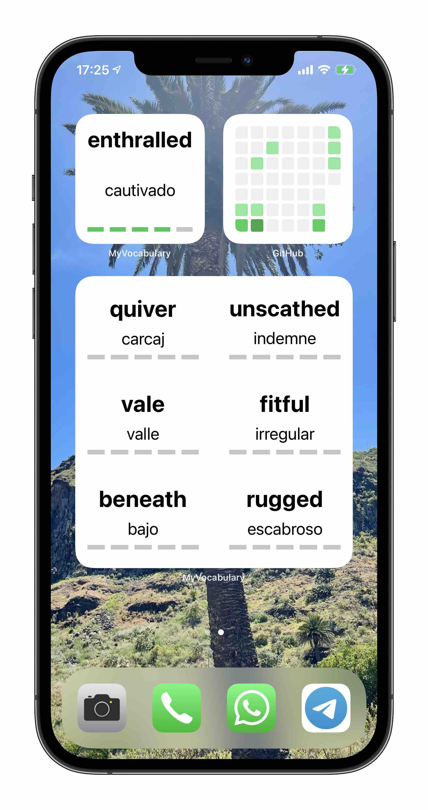

If we want to have more than one widget, `WidgetBundle` has to be implemented.

This new bundle, will show the 6 translations with the lowest level. The timeline will have a `.never` policy because we only want it to change when the timelines are reloaded manually...
```swift
WidgetCenter.shared.reloadAllTimelines()
```

The entries of the timeline, will have a different structure...

```swift
struct MultipleEntry: TimelineEntry {
    let date: Date
    let translations: [Translation]
}
```

... the timeline is generated differently, so a new provider has to be created as well, but the most important part is the `Widget` implementation. As there will be two widgets, none of them can be the `@main`.

```swift
struct MultipleTranslationsWidget: Widget {
    let kind: String = "MultipleTranslationsWidget"

    var body: some WidgetConfiguration {
        StaticConfiguration(kind: kind, provider: MultipleProvider()) { entry in
            MultipleTranslationsWidgetEntryView(entry: entry)
        }
        .configurationDisplayName("6 most difficult translations")
        .description("These are the 6 translations with the lowest level.")
        .supportedFamilies([.systemLarge])
    }
}

struct RandomTranslationWidget: Widget {
    let kind: String = "RandomTranslationWidget"

    var body: some WidgetConfiguration {
        StaticConfiguration(kind: kind, provider: RandomProvider()) { entry in
            RandomTranslationWidgetEntryView(entry: entry)
        }
        .configurationDisplayName("Random translation")
        .description("The translations changes every 5 seconds.")
        .supportedFamilies([.systemSmall])
    }
}

@main
struct MyVocabularyWidgets: WidgetBundle {
    var body: some Widget {
        RandomTranslationWidget()
        MultipleTranslationsWidget()
    }
}
```

A `WidgetBundle`, containing both widgets, will be the `@main`.



### Localization

The strings `description` and `configurationDisplayName` of the widgets, have to be localized. As we have done previously, just add the new keys and values to the `Localizable.strings` files, but remember to support the target of the widget in those files. Otherwise, they would not be accessible.

### Accessibility

This Apple feature must be taken into consideration in the widgets too.

#### Dynamic Type in widgets

Try to use default fonts and the size of the text will grow and shrink accordingly to the user's preferences.

Take into consideration that widgets have reduced space, you may want to add a `lineLimit` or  `minimumScaleFactor` to the texts.

```swift
.lineLimit(1)
.minimumScaleFactor(0.2)
```

#### VoiceOver in widgets

Just add `accessibilityLabel` to the widget's view, the string will be translated if the key is available in `Localizable.strings`.

```swift
.accessibilityElement(children: .ignore)
.accessibilityLabel("\(translation.translationInput) in \(translation.translationFrom), \(translation.translationOutput) in \(translation.translationTo) . Level \(translation.level).")
```


---

