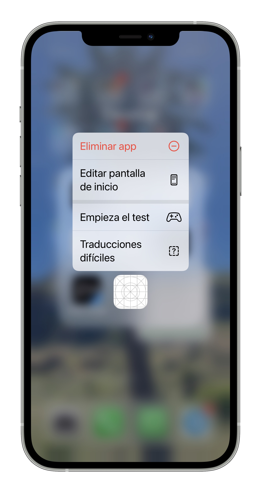
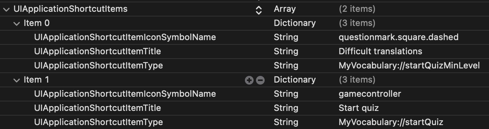
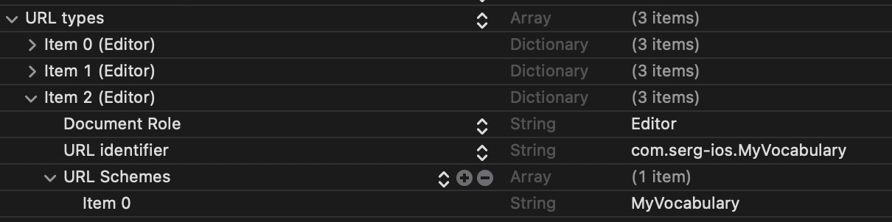
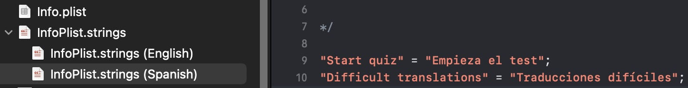

This kind of actions appear when the app icon is long pressed.



### ShortcutItem

To declare a new quick action, just add a **ShortcutItem** it to the `plist` file.



Must have:

- An icon name, I used *SF Symbols*.
- A title, that can be localized.
- A type, this will identify the action univocally.

```xml
<key>UIApplicationShortcutItems</key>
<array>
    <dict>
        <key>UIApplicationShortcutItemIconSymbolName</key>
        <string>gamecontroller</string>
        <key>UIApplicationShortcutItemTitle</key>
        <string>Start quiz</string>
        <key>UIApplicationShortcutItemType</key>
        <string>MyVocabulary://startQuiz</string>
    </dict>
</array>
```

### URLScheme

Defining an **URLScheme** in the `plist` file as well is necessary to open the app when the _UIApplicationShortcutItem_ is launched.




The **type** of the Quick Action starts with the **URL Scheme**.

```xml
<key>UIApplicationShortcutItemType</key>
<string>MyVocabulary://startQuiz</string>
```

That's how the system knows which app to open.

### Localization

To localize `plist`'s texts, create a strings file called `InfoPlist.strings`.



[Here](https://developer.apple.com/library/archive/documentation/General/Reference/InfoPlistKeyReference/Articles/AboutInformationPropertyListFiles.html#//apple_ref/doc/uid/TP40009254-102276) is the official documentation.


---

