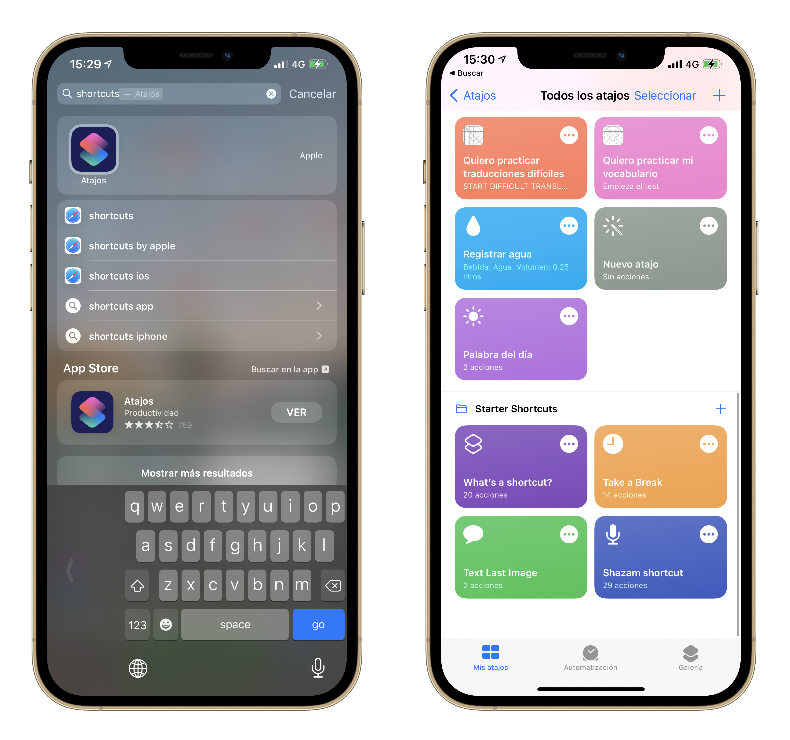

Another way to open the app is through a Siri Shortcut. Any action available as a shortcut, must be registered the first time that is executed.

```swift
struct ContentView: View {

    // ...
    
    @State private var activity: NSUserActivity?

    // ...

    Button {
        registerSiriShortcut()
    } label: {
        Text("Press this button to register the shortcut.")
    }

    // ...

    func registerSiriShortcut() {
        activity = NSUserActivity(activityType: "com.serg-ios.MyVocabulary.startQuiz")
        activity?.title = NSLocalizedString("Start quiz", comment: "")
        activity?.isEligibleForSearch = true
        activity?.isEligibleForPrediction = true
        activity?.becomeCurrent()
    }
}
```

The activity type has to be registered in the `Info.plist` file.

```xml
<key>NSUserActivityTypes</key>
<array>
    <string>com.serg-ios.MyVocabulary.startQuiz</string>
</array>
```




---

