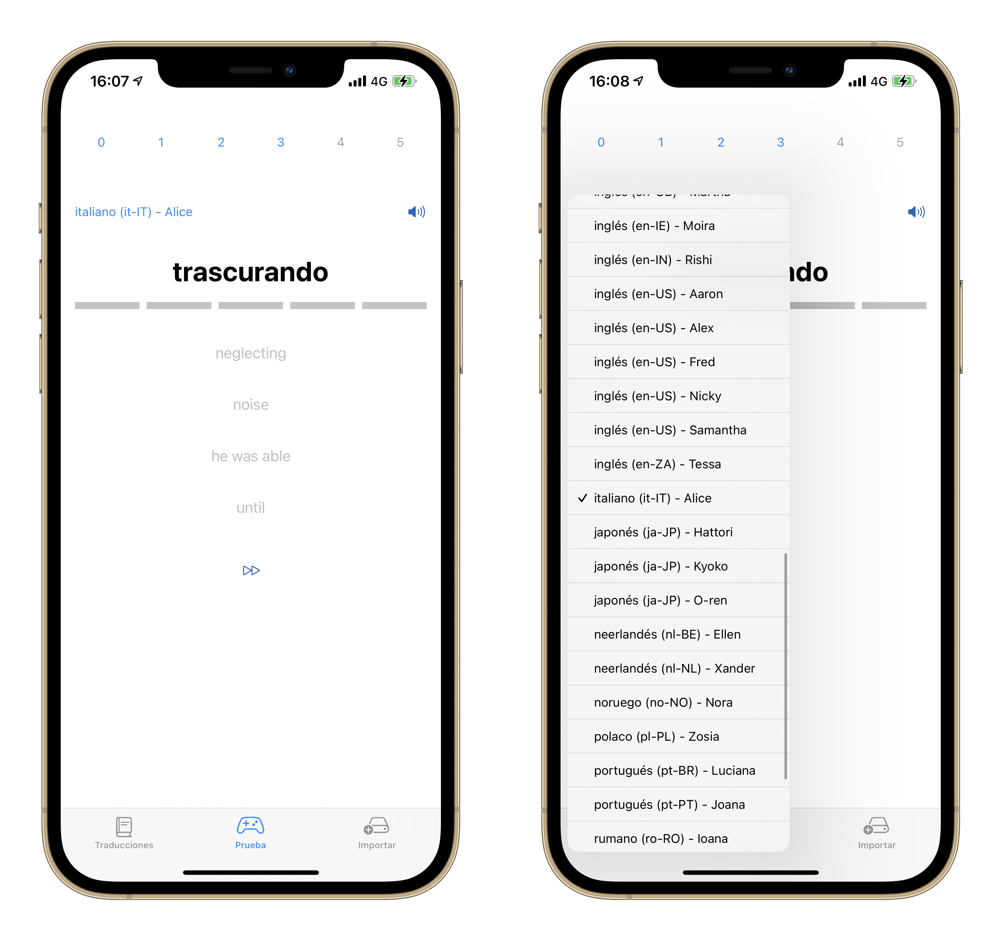

Pronunciation is very important when learning a language, iOS has the capability of reading whatever text is in the screen (given a language) with `AVSpeechSynthesisVoice`.

First, import `AVFoundation`.

```swift
import AVFoundation
```

Then select the language.

```swift
AVSpeechSynthesisVoice.speechVoices() // Returns [AVSpeechSynthesisVoice]
```

Each voice has a `language` (Spanish, English, etc) and a name (Laura, Daniel, Yu-Shu, etc). This is useful to show all the available options to the user.

Once the voice is selected, the text can be read.

```swift
let utterance = AVSpeechUtterance(string: text)
utterance.voice = voice
let synthesizer = AVSpeechSynthesizer()
synthesizer.speak(utterance)
```



### VoiceOver conflict

There is a problem when it comes to read the screen with VoiceOver.

The button that reads the text with `AVSpeechSynthesizer` when its pressed, must have an `accessibilityLabel` to indicate VoiceOver users its purpose.

The problem comes when the user double-taps the screen to press the button and simultaneously, the VoiceOver reads again the `accessibilityLabel` while the speech synthesizer is reading the text.

A workaround would be to add a delay to the `accessibilityAction` of the button.

```swift
Button {
    if !UIAccessibility.isVoiceOverRunning {
        readOutLoud(translation)
    }
} label: {
    Image(systemName: "speaker.wave.3.fill")
}
.accessibilityElement()
.accessibilityLabel("Listen")
.accessibilityAction {
    DispatchQueue.main.asyncAfter(deadline: .now() + 1, execute: {
        readOutLoud(translation)
    })
}
```

---

